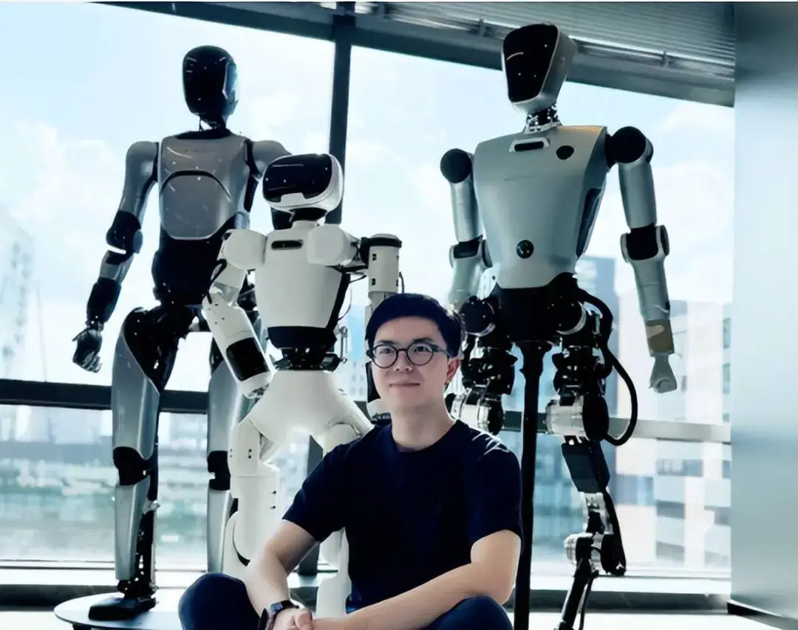
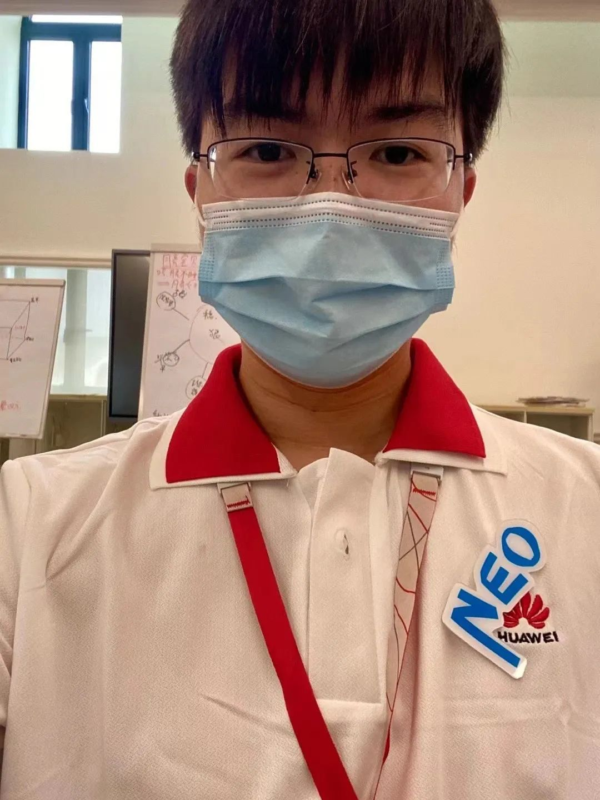
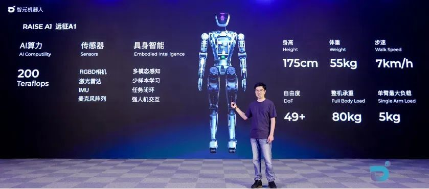

# 智元机器人创始人彭志辉：从小酷爱电子产品 放弃201万年薪工作

> Source: https://jx.ifeng.com/c/8hhMnkd2EVg
> Collected: 2026-05-20
> Published: 2025-03-14
> Author: 都市现场 / 凤凰网江西
> Original clipping: ../../一级市场-具身智能本体/已导入/智元机器人创始人彭志辉：从小酷爱电子产品 放弃201万年薪工作.md

一份工作

如果能给201万的年薪

大部分人应该会

求之不得、特别珍惜

然而

江西的一位“90后 ”却放弃了

前几天

中国首个通用具身基座模型

智元启元大模型GO-1正式发布

智能人形机器人灵犀X2也对外亮相

**研发该产品的“智元机器人” 联合创始人彭志辉**

**开始被更多人所知**

3月12日下午，都市现场记者在江西省吉安市白鹭洲中学门口见到了彭志辉高中时期的班主任老师欧阳文郞，他目前已经退休，之前教彭志辉物理课目。虽然彭志辉已经毕业多年，欧阳文郞对他还留有深刻印象。

**吉安市白鹭洲中学退休教师 欧阳文郞：** 在校的时候主要特点，一个是性格比较内向，比较喜欢玩这些电子产品，那个时候就比较突显理科方面的特长。

欧阳文郞告诉记者，彭志辉当时在白鹭洲中学最好的实验班就读，他数理化成绩特别突出，英语和语文相对薄弱一些，所以高考成绩在班上只能算是中等水平。

**吉安市白鹭洲中学退休教师 欧阳文郞：** 2009年实际上他应届的时候是上了一本线，当时录在杭州电子大学但是没去，重读了一年以后再去的四川电子科大，四川电子科大当时的本科应该是生物工程，然后研究生再读了人工智能这一块。

二战高考、跨专业考研.......彭志辉似乎是“曲线救国”——才学到了自己钟爱的专业，也为他后来在AI领域的发展打下了坚实的基础。

2018年，彭志辉从电子科技大学毕业，进入了OPPO，成为AI实验室的算法工程师。随后，他以“天才少年”的身份加入了华为。

值得一提的是，彭志辉在加入华为之前已经是一位拥有百万粉丝的博主。他的博客充满技术含量，几乎没有人能够模仿。他以“稚晖君”和“野生钢铁侠”的名号在网络上广受欢迎。

此外，彭志辉还喜欢弹吉他、摄影，甚至对打乒乓球情有独钟，为此还专门制作了一个陪他练习的机器人。 可以说，彭志辉是一个“斜杠青年”。

2020年，彭志辉以最高档年薪201万元加入华为“天才少年计划”时，欧阳文郞和彭志辉曾经联系过。当时彭志辉从事昇腾AI芯片和算法研究，期间主导开发了自动驾驶自行车等创新项目。

在华为工作期间的彭志辉

2022年底，彭志辉从华为离职。2023年2月他和伙伴联合创立智元机器人公司，专注于通用人形机器人研发，2023年8月团队推出首款具身智能机器人“远征A1”，2024年12月开启商用量产，2025年1月第1000台下线。他的项目获得高瓴创投、红杉中国、比亚迪等资本支持，与科大讯飞等企业达成战略合作，被粉丝称为“野生钢铁侠”，其技术成果多次引发全网热议。

从小喜欢电子产品 兄弟俩都是“IT男 ”

彭志辉是吉安市永新县高溪乡梅花村人，从小随父母在吉安上学，目前他父亲彭天文和彭志辉弟弟在深圳生活，他弟弟也是从事IT行业，他父亲说彭志辉从小就对电子产品有浓郁的兴趣。

**彭志辉父亲 彭天文：** 三四岁开始就喜欢这些电子的产品，他自己选的电子信息专业，以他的成绩来说可以选一个更好的大学，他对那个电子专业特别感兴趣。

彭天文表示，现在除了过年，他们很少和彭志辉相聚，因为彭志辉这几年特别忙。

**智元机器人创始人彭志辉父亲 彭天文：** 这一两年他们在研发机器人方面要费很多时间，包括他本人也特别辛苦，经常熬夜熬通宵这样子，我们都怕他身体搞垮，不要那么辛苦，经常熬夜的。

如今，彭志辉的机器人研发项目取得重要进展并实现量产，他的家人和老师都表示很自豪。

**吉安市白鹭洲中学退休教师 欧阳文郞：** 也感到非常荣幸，一辈子能教出这么一个学生来，为我们学校争光，也为吉安人民争了光，当然也为江西人争了气，希望他以后发展得越来越好，希望他成为全国这种机器人方面或者是人工智能方面的领头人。
