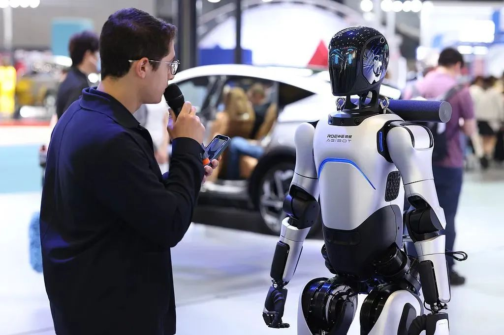
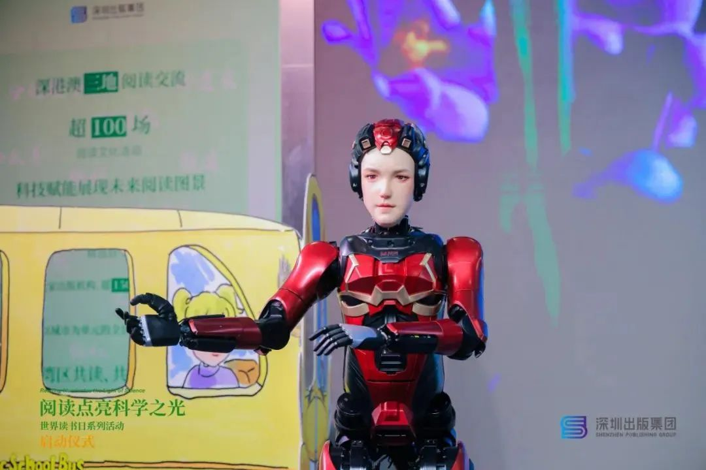

# 解剖「智元机器人」：资本棋局和「华为系」操盘手-36氪

> Source: https://36kr.com/p/3311849506414338
> Collected: 2026-05-20
> Published: 2025-05-28
> Author: 王方玉 / 36氪
> Original clipping: ../../一级市场-具身智能本体/已导入/解剖「智元机器人」：资本棋局和「华为系」操盘手-36氪.md

在“华为系”团队操盘下，智元机器人表现出不同于创业公司的风格和打法。

一面融资输血，一面投资产业链，近几个月，具身智能独角兽“智元机器人”的资本运作可谓是眼花缭乱。

5月20日，具身智能初创企业“安努智能”宣布完成数千万级种子轮融资。工商资料显示，在安努智能的股东列表中，独角兽智元机器人赫然在列，持股比例为20%。

这不是智元机器人第一次对外投资机器人公司。

2025年以来， **智元机器人以每月一家的速度和上市公司联合成立机器人公司。** 据“智能涌现”统计，智元机器人的上市公司合资伙伴包括了博众精工、大丰实业、卧龙电驱、软通动力、均普智能、东阳光、富临精工等。

也就是说，智元机器人如今不光自己造机器人，还和上市公司联合造机器人。

| 合作上市公司 | 合资公司名称 | 智元机器人占股 | 投资时间 |
|---|---|---|---|
| 软通动力 | 软通天擎机器人 | 5% | 2024年12月 |
| 东阳光 | 光谷东智具身智能 | 15% | 2025年2月 |
| 富临精工 | 安努智能 | 20% | 2025年2月 |
| 蓝思科技 | 智启未来 | 15% | 2025年3月 |
| 卧龙电驱 | 希尔机器人 | 未工商变更 | 2025年3月 |
| 博众精工 | 灵猴机器人 | 0.8% | 2025年4月 |
| 大丰实业 | 签署合作协议，尚未成立 | 15% | 2025年4月 |
| 均普智能 | 普智未来机器人 | 15% | 2025年4月 |

表：智元机器人和上市公司成立合资公司。图源：智能涌现制图

作为一家创业公司，智元机器人还直接投资了数家具身智能产业链上的创业公司，包括了数字华夏、灵初智能、千觉机器人、富兴机电等，涵盖了机器人零部件、具身智能系统、仿生机器人等多个领域。

这样密集的资本运作，一度让很多业内人士直呼“看不懂”。

一直以来，智元机器人在台前示人的形象，以华为前“天才少年”彭志辉为主，其网名“稚晖君”，在B站是百大UP主，放在整个科技圈也颇具影响力，展示出智元科技感、极客范儿的一面。

但现实中的智元机器人，在经营中表现出截然不同的气质， **它收起了极客只埋头技术的nerdy气质，转而成为一个擅长生态构建与资源整合的资深操盘手。**

“智元采取的是生态打法——先迅速成为一个大公司，同时孵化其他创业公司，建立起自己的产业生态。说实话，这种做法不像是一家传统创业公司。”星海图联合创始人许华哲曾在接受采访时评价道。

直到今年4月一则工商登记资料变更的消息，揭开了智元机器人不为大众所知的另外一面。

工商登记平台资料显示，上海智元新创技术有限公司于4月初完成工商变更，公司法定代表人则由舒远春变更为一个全新的名字——邓泰华。邓泰华早年间是华为王牌业务无线产品线（通信基站，如5G等）的负责人，后来担任华为公司原副总裁、计算产品线原总裁。

但实际上， **邓泰华并非最新“加入”智元，他一直是这家机器人独角兽的创始人及实际控制人** ，只是此前一直隐匿于背后未对外公开，以致于部分媒体报道将上述工商变更报道为“华为前副总裁邓泰华加入智元机器人”。

不只是邓泰华，智元机器人的高管团队，还包括首席运营官邱恒（前华为中国政企业务CMO）、合伙人兼营销副总裁姜青松（前华为P&S解决方案产品管理部部长），别忘了，就连稚晖君本人，此前也是华为昇腾计算产品线的全栈研发工程师。

这样“华为系”的团队构成，也解释了智元机器人熟练的资本运作和生态打法究竟从何而来。

**这不是一个天才少年创业追求具身理想的浪漫主义故事，而是一个资源操盘手编织生态、打造机器人巨头的现实主义故事。**

### “用经营大公司的方式创业”

在邓泰华领衔的“华为系”操盘下，智元机器人表现出与其他具身智能创业公司截然不同的风格和打法。 **不少行业人士对“智能涌现”形容其“用经营大公司的方式创业”、“从DayOne就开启全要素竞争”。**

由于人形机器人技术尚不成熟，在业务定位时大多数机器人创企会侧重发展某项能力，有的项目侧重“脑”，有的专注机器人本体，从形态上来说，有的项目专注于上肢操作能力，有的则专注于下肢运动能力。

智元机器人则是全面发展。 **“智元是为数不多，能够在本体、小脑和大脑都能够进行全栈布局的人形机器人公司。”** 智元机器人灵犀业务线总裁魏强近日在接受媒体采访时表示。

就产品来说，大多数人形机器人创企会专注于一到两款产品，例如同样走软硬件一体路线的“银河通用”，至今只有G1一款机器人本体产品。而智元机器人在去年8月，就一口气发布了5款人形机器人。

官网产品图显示，智元的硬件产品包含了远征、灵犀、精灵、绝尘4个系列，产品类别包含了交互服务机器人、柔性制造机器人、商用清洁机器人等。形态上既有人形双足，也有底盘，甚至还有传统的非人形。

此外，魏强近日对媒体透露，公司还计划 **在二季度发布一款四足机器人灵犀D1。**

智元远征系列机器人担任“销售顾问” 图源：视觉中国

智元并未选择一般创业公司采取的代工组装方式，而是在上海临港建立工厂，实现了直接投产。这是个有些冒险的举措。一家机器人公司的负责人告诉智能涌现，自建机器人工厂资产重、风险大，初创企业一般都会选择代工的方式起步。

智元为何选择高举高打，出手就像大公司一样铺开摊子、砸下重金？

“这是智元的一种竞争策略，可以在投资方面前树立形象，营造出领先的势能，毕竟规模比技术更容易做出来。”一位资深具身投资人告诉智能涌现，当前具身智能赛道固然火热，但商业化一直是行业的痼疾，企业很难通过自身造血， **融资就成了创业公司生存的关键因素之一。**

“在企业竞争方面，目前最主要集中在融资领域，融资跟不上就快被淘汰了。”松延动力创始人姜哲源就在近期接受采访时表示。

智元机器人的融资策略被证实非常成功。它在成立之后的数月内估值快速抵达10亿美金，成为全球最快跻身独角兽的一家具身智能公司。今年3月，智元完成了由腾讯领投的B轮融资，近期又完成了京东科技领投的新一轮融资。

当然，随着估值高企，智元机器人也面临着更大的商业化和技术上的压力。上述投资人告诉智能涌现：“智元估值越涨越高，新一轮融资估值到了150亿元，势必面临着来自于投资方对于公司收入的要求。只有技术成果不够，还得有商业化成果。”

### 现实主义的具身智能故事

按照估值，目前国内人形机器人创业公司已经形成了鲜明的梯队，第一梯队的公司有三家：宇树科技、智元机器人和银河通用。第二梯队的公司则包括逐际动力、千寻智能、智平方等十多家。

**智元机器人是第一梯队中最特殊的角色** 。按照真格基金的看人理论，宇树科技的创始人王兴兴和银河通用的创始人王鹤可以归类到“技术派”，而邓建华则要归类为“操盘手”，一般是指在大公司有带队经验的管理人才，他们有独立决策、从0到1的经验。

不同类型的创始人，也赋予了企业不同的风格和特质。

宇树科技的王兴兴研究机器狗起家，专注硬件，至今不碰具身智能大模型；银河通用王鹤一直坚持以仿真数据驱动具身智能模型训练的技术路线，且至今只做过一款机器人本体。他们都选择了特定的方向或技术路线，有一种“技术派”的坚持。

**智元机器人则代表了一种更现实主义的选择和趋向** ：软硬件都做，多条模型技术路线都探索，对于自研或者采购第三方的选择也十分开放。

例如在具身智能模型的选择上，智元一方面投资了具身智能模型公司灵初智能，还与美国具身智能模型公司Physical Intelligence（PI）达成合作，同时也在自研具身智能模型启元大模型GO-1。

再例如，智元并不局限于做人形机器人，而是把业务扩展到了商用清洁机器人。这类传统机器人商业化应用已经成熟，可以快速形成收入。为扩展该业务，智元还从商清龙头企业高仙机器人那里挖角人才。

“好像只要有利于扩大收入、占领市场的事情，智元都可以很灵活参与。”一位业内人士对智能涌现评价道。

通过广泛的战略投资和上市公司合作，智元打造出了一个产业生态，也可以帮助其更快地实现商业化和规模化。

计划与智元机器人成立合资公司的上市公司大丰实业就在今年3月的公告中披露称， **将在合资公司成立后一个季度内向智元提供不低于1500万元意向采购订单。**

智元投资的创业公司数字华夏，则与智元联合开发了仿生机器人“夏澜”，主攻教育、医疗、酒店服务、商场导购等场景。

投资了智元的蓝驰创投合伙人曹巍直言：“智元机器人有大量的产业股东，比如比亚迪、上汽等，仅来自股东方的需求， **可能就创造出几万台机器人的销量。”**

仿生机器人“夏澜” 图源: 数字华夏官网

去年12月，智元机器人宣布率先开启通用机器人商用量产。据其披露，截至去年12月底，智元的量产工厂总计下线超过900台人形机器人。公司合伙人、具身智能事业部总裁姚卯青曾在接受采访时表示，智元2025年机器人出货量计划保持在数千台，营收数将保持数倍规模增长。

### 补上缺失的一课

通过高举高打和全要素竞争，智元机器人在融资、商业化等领域取得了先发优势。但这种策略也并非没有短板——作为一家创业公司，同时做多款产品，布局多个技术方向，如果不把资源集中在最核心目标之上，更难以取得突破。

**具身智能大模型，就是智元机器人相对薄弱的技术能力之一。**

“如果看估值，智元和银河通用、宇树科技三家在具身赛道的第一梯队，但如果看模型能力，智元排不进第一梯队，它的demo（演示视频）表现出的泛化性很一般。”上述资深具身智能投资人对智能涌现评价。

该投资人表示，目前一些优秀的具身智能大模型已经可以实现一镜到底的叠衣服、刮胡子、拉拉链，而智元在今年3月发布的启元大模型并没有复现上述复杂能力，而是相对简单的PPT操作（即Pick抓取、Place放置和Transfer转运）。

智能涌现此前曾报道，智元机器人2024年6月决定研发机器人具身智能大模型，这个时间点在动作节拍上已经落后于自变量机器人、穹彻智能等业务偏重具身智能模型的创业公司半年多的时间。

2024年下半年，智元机器人的研发团队还曾经历了调整，多位核心研发人员离职。其中有公开去向的包括原具身组长朱光沸加入众擎机器人，前首席技术专家高翔加入了小笨智能。

之后，智元则相继引入了前蔚来工程总监姚卯青(任具身智能事业部总裁)、前谷歌学者罗剑岚（任首席科学家）等具身智能模型方向的相关人才。加上姚卯青从蔚来带去的部分员工， **智元机器人的具身智能模型团队已初现雏形。**

通过一系列动作，智元机器人正在努力补足其具身智能大模型能力，以缩小和竞争对手的差距。

智元机器人方面透露，公司的最新模型已经训练出可以执行比较完善的推理任务和精细操作，如自动识别桌面垃圾并进行清理等。

2025年被很多具身智能从业者称为人形机器人的“量产元年”和“商用元年”。但由于泛化性、通用性不足，当下人形机器人的商业化前景仍不清晰。现有的主要应用场景如科研、政府接待、迎宾引导等不仅规模有限，且市场需求很难持续。

这背后的根源还在于“脑”的智能不足的问题。

当前机器人成功率最高、最快落地的操作是“PPT”，Pick（抓取）、Place（放置）和Transfer（转运），这类操作可以解决的实际问题、适应的应用场景非常有限。要解锁更复杂的场景和动作，打开更大的下游市场，则需要等待具身智能大模型的技术新突破。

如果“脑”的能力不能实现突破，即使智元的股东与合作方可以带来几万台销量，未来的销量增长也很难持续，企业成长将会很快碰到天花板。

通过资源整合和产业生态布局，智元机器人在融资和商业上无疑先人一步，但长远来看，如何将“软”（大脑）+“硬”（本体）协同发展，智元还需要更厚的积蓄。
