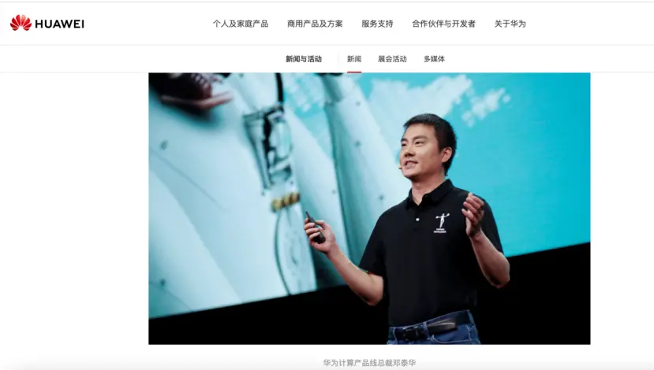

# 谁是邓泰华？

> Source: https://tech.ifeng.com/c/8l25zYQtWZV
> Collected: 2026-05-20
> Published: 2025-07-16
> Author: 直面AI / 凤凰网科技
> Original clipping: ../../一级市场-具身智能本体/已导入/谁是邓泰华？.md

刚刚完成对上市公司上纬新材收购的智元机器人，近期又引入了正大集团的战略投资。一系列举措，都让稚辉君背后的关键人物——智元机器人董事长兼CEO邓泰华，走到镁光灯下。

**邓泰华甚至一定程度上充当了稚辉君创立智元的引路人角色。** 据《科创板日报》报道，正是邓泰华邀请当时还在华为工作的稚晖君（彭志辉）创业，才有了如今这家估值150亿元的智元机器人。

《中国经营报》也报道称，有智元机器人内部人士确认，邓泰华实际上一直担任该公司的创始人、董事长及首席执行官，“只是过去他一直保持低调”。

在创立智元机器人之前，邓泰华曾在华为工作二十余年，早年间是华为王牌业务无线产品线（通信基站，如5G等）的负责人，后来担任华为公司副总裁、计算产品线总裁，主导了鲲鹏、昇腾AI计算生态构建。

邓泰华在主导华为昇腾AI芯片及鲲鹏算力平台期间积累的经验，为他进军具身智能领域奠定了基础。这些技术，也恰恰是构建人形机器人“大脑”（AI决策）与“神经系统”（通信控制）所需要的技术。

至于邓泰华何时从华为离职，并没有详细报道。但2022年11月他仍以华为副总裁、计算产品线总裁身份公开亮相，而智元成立于次年2月。2023年9月出现在华为全联接大会上的华为计算产品线总裁，就变成了张熙伟。

**过去两年，稚辉君作为核心人物活跃于台前，但智元真正的核心大佬，或许是邓泰华。**

今年3月，智元机器人的法定代表人由舒远春变更为邓泰华。与此同时，邓泰华也正式走向台前，被公开报道为智元的董事长兼CEO。智元入股上纬新材后，舒远春将所持致远新创99.9%的股权和智元机器人2.62%的股权转让给邓泰华，交易完成后，上纬新材的实际控制人将变更为邓泰华。

**在智元机器人成立仅两年估值就赶超成立九年的宇树科技，并有望通过借壳上市距离IPO更进一步的过程中，邓泰华无疑是核心推手。** 可以说，有可能“超越”王兴兴的不是稚辉君，而是邓泰华。

**01** **从通信到AI，邓泰华与稚辉君在华为相遇**

作为一个技术大佬，除了产品和技术发布会，邓泰华并不怎么活跃在公开场合，也鲜少出现在公开报道中。

可以确定的是，他毕业于电子科技大学计算机通信专业，毕业后就进入华为，在华为工作超过20年。

在华为期间，邓泰华曾担任多个重要的管理岗位。在近十年华为公开的新闻报道中，邓泰华曾担任过华为无线网络TD-LTE&TD-SCDMA&WiMAX产品线总裁、东北欧地区部副总裁、无线产品线总裁、华为计算产品线总裁、华为副总裁等。

上述经历，让邓泰华在通信与AI领域积累了深厚的技术与管理经验。尤其是2020年9月，已经以华为计算产品线总裁身份出现的邓泰华，从通信领域转向了AI领域，距离机器人更进一步。

图源：华为官网

在担任计算产品线总裁之后，邓泰华主导了鲲鹏服务器芯片、昇腾AI处理器生态的构建。2020年9月，在华为CONNECT大会上，邓泰华宣布，华为向业界全面开放鲲鹏全栈、昇腾全栈、发布分布式多样性计算软件套件。

邓泰华主导期间，鲲鹏、昇腾的开发者群体快速增长。2020年起步后，2021年9月达到100万，2022年6月则超过了200万。

也正是在邓泰华计算产品线总裁任上，同为电子科技大学校友的稚辉君，被华为以“天才少年”的待遇招入公司，成为计算产品线昇腾部门的一员，从事昇腾AI芯片和AI算法相关研究工作。两人由此成为上下级关系。

**这两位智元后来最重要的核心人物，在华为开启了AI领域的研究。**

**02** **风口已至：邓泰华、稚辉君逐梦机器人**

**邓泰华和稚辉君选择人形机器人赛道，或许早有契机。**

在华为工作两年的稚辉君，于2022年12月离职，他说自己接下来要做的事情，是一直以来的热爱和梦想。

早在读书期间，稚辉君就已经和同学们一起做了和机器人相关的创业项目，当时还拿下了500多万元的天使投资。 **但由于团队缺乏管理、市场等概念，稚辉君最终退出了这个项目。**

稚辉君从华为离职时，就有知情人士透露称，稚辉君觉得机器人业务华为短期不太可能大规模投入，所以决定出去做。后来稚辉君自己在接受《晚点LatePost》的采访中说， **是由于风格问题离开，华为在技术方面主要是搞基建，偏向底层技术。** 而机器人是一个非常新的赛道，适合迭代较快的团队。

作为稚辉君在华为期间的领导， **时任华为计算机产品线总裁的邓泰华，则更近距离地参与到了AI与机器人领域。**

邓泰华在华为时期就非常贴近人形机器人，华为2022年4月首次涉足该领域与达闼机器人的合作就有他的身影，他明确提出华为可在昇腾AI基础软硬件平台、欧拉操作系统等方面提供支持。

图源：华为官网

这一年，邓泰华还参观了一家北京的人工智能公司——智行者科技，双方的合作也涉及到昇腾AI。当时，邓泰华还对智行者加入华为机器人生态表示欢迎。

**更为重要的是，邓泰华和上海人工智能研究院建立起了联系。**

2022年7月，华为与上海人工智能研究院达成合作，共同构建昇腾AI产业生态。当时，邓泰华和上海人工智能研究院执行院长宋海涛共同见证了签约仪式。同年9月，世界人工智能大会上，宋海涛因在昇腾AI生态建设上的重要贡献受聘昇腾MVP。邓泰华就是颁发聘书的嘉宾之一。

**后来的智元机器人也孵化于上海人工智能研究院，智元团队中的首席科学家和工程化团队，便是上海人工智能研究院给配备的。** 比如上海人工智能研究院智慧康养首席科学家闫维新，以及上文提到的宋海涛。

如果说这些为双方进军人形机器人赛道提供了可能性，那么时代的风向则是导火索。

2022年10月，马斯克的人形机器人擎天柱首次亮相；次月，OpenAI发布了ChatGPT。AI大模型的技术迭代，让机器人有了更多可能性。 **身处AI领域的稚辉君和邓泰华，自然也感受到了风向的变化。稚辉君说，“我在华为昇腾就做AI计算，这个趋势看得比较清楚。”**

**03** **邓泰华入局，智元机器人开启“加速度”**

2023年2月，智元机器人孵化于上海人工智能研究院，稚辉君作为联合创始人及CTO加入。

公司创立之初即获天使投资，但后续长期停留在A轮融资阶段。直到邓泰华以智元创始人、董事长兼CEO的身份正式亮相并掌舵， **局面才发生根本性转变，智元迈入B轮融资。**

图源：企查查

实际上，据《联合早报》旗下产品“新加坡鱼尾文”报道，早在2024年11月，新加坡前总理李显龙参访智元时，邓泰华就已经作为创始人身份出现。同年12月，智元开启通用机器人商用量产。

**自今年3月邓泰华上任之后，智元的速度明显更快了，不仅表现在技术进展方面，还有资本运作层面。**

今年3月，智元机器人正式发布首个通用具身基座模型——智元启元大模型GO-1。4月，智元机器人发布行业首款面向具身智能开发者的一站式开发平台Genie Studio，打通了具身智能从数据到部署的完整链路，给开发者提供全流程的解决方案。

在融资方面，从2023年4月开始，智元已经在A轮融资了七轮，时间跨度为18个月。今年3月，在邓泰华带领下，智元跨过A轮融资进入B轮，不仅吸引了如腾讯、京东等头部大厂，更在两个月内完成两批次的B轮融资，企业估值高达150亿元。

图源：企查查

在投资布局方面，邓泰华主导智元积极对外投资，还和上市公司联合造机器人。据《智能涌现》统计，去年12月以来，智元机器人的上市公司合资伙伴包括了博众精工、大丰实业、卧龙电驱、软通动力、均普智能、东阳光、富临精工等。

不过，在这些投资中，智元机器人的持股比例并不高，一般在20%以内。 **入股上纬新材，是智元入股上市公司中持股比例最高的一次，合计收购上纬新材至少63.62%、至多66.99%的股份。**

尽管智元方面多次否认这是借壳上市，但是依然难以阻挡外界对于智元IPO的猜测。

在邓泰华的操盘下， **智元机器人已成为人形机器人领域最接近IPO的企业，同时也是华为系创业者创立的人形机器人公司中，最接近IPO的企业。**

此前，《直面AI》就曾统计分析，离开任正非的天才少年里，藏着一个机器人军团，越来越多前华为人涌入人形机器人领域。

如华为车BU双子星陈亦伦和丁文超，从智驾转行到具身智能领域，去年7月创办了它石智航，近半年已完成两次天使轮融资，累计金额为2.42亿美元，创下了中国具身智能行业天使轮的最大融资额纪录。其中，作为首席科学家的丁文超，和稚晖君同一批通过华为“天才少年”计划进入华为。

曾在华为美国研究院担任首席架构师兼首席技术官的胡鲁辉，找了之前在微软、华为等的一些同事组成了核心创始团队，在2024年年初创建了具身智能公司智澄AI。目前，智澄AI已发布第五代通用人形机器人。

凭借着技术和人才优势， **这些华为系创始人正在人形机器人领域上演一场同门竞技的创业景观。**
