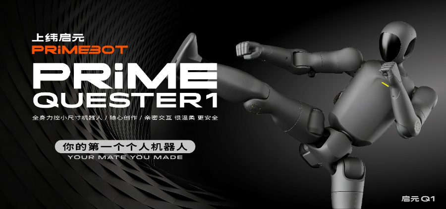

# 上纬新材正式进军人形机器人！稚晖君发布小型化机器人启元Q1

> Source: https://www.21jingji.com/article/20251231/herald/ee50c1ec508547b9420530135d3f5166.html
> Collected: 2026-05-20
> Published: 2025-12-31
> Author: 21世纪经济报道记者 赵云帆 / 21财经APP
> Original clipping: ../../一级市场-具身智能本体/已导入/上纬新材正式进军人形机器人！稚晖君发布小型化机器人启元Q1 - 21经济网.md

## 原文

###### 2025年12月31日 20:40 21世纪经济报道 21财经APP 赵云帆

**21世纪经济报道记者 赵云帆**

12月31日，上纬新材发布全球首款全身力控小尺寸人形机器人“启元Q1”。

同时，上纬新材董事长，智元机器人联合创始人彭志辉（稚晖君）宣布，公司将以“上纬启元”品牌进军个人机器人赛道。

值得注意的是，此前，上纬新材曾于官方微信订阅号“智元上纬”推送即将发布人形机器人新品牌的信息，但随后删除了相关文章。

今年早些时候，科创板上市公司上纬新材控制权变动，智元机器人董事长和创始人邓泰华控制的主体收购上纬新材控制权，同时邓泰华成为公司实控人。

上纬智元方面表示，作为全球最小全身力控人形机器人，启元Q1在关节系统、整机尺寸与应用场景上均实现了多项突破，将实验室级的人形机器人能力浓缩至背包大小的体量中。

公司还表示，新品牌“上纬启元”将明确聚焦“个人机器人”方向，致力于将高端机器人技术转化为普通人可拥有、可操作、可创造的个人设备。

上纬智元还表示，其通过材料、结构与控制算法的多维创新，将QDD准直驱关节成功压缩至“比鸡蛋还小”，同时完整保留了全尺寸机型的力控性能与高动态响应能力。机器人重量也随之降低，具备“耐摔、耐炸”的物理特性，即便从高处跌落也能保持稳定运行，小型化设计也降低了研发试错成本。

据悉，该款启元Q1，主要面向科研者、创意玩家与广泛的家庭用户。
