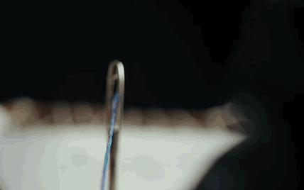
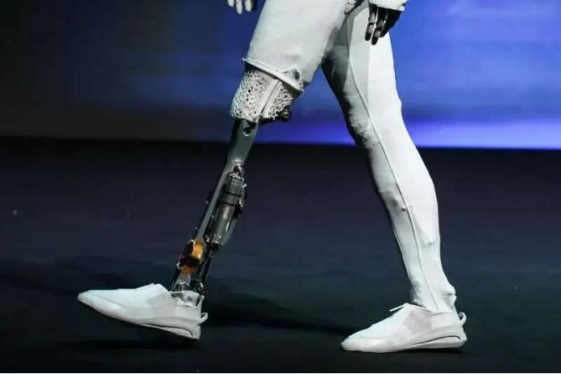
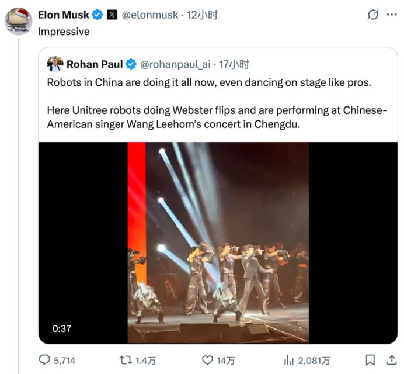

# 机器人赛道挤满了车圈大佬

> 原始剪藏：`Clippings/机器人赛道挤满了车圈大佬-36氪.md`
> 说明：本文为 36氪经微信公众号 AutoReport 汽车产经授权发布的二手报道；表格和融资口径按原文保留，后续应以公司公告、工商、投资方公告和客户侧材料核验。

从智能驾驶领域到具身智能领域，一场“人员迁徙”正在进行。

2025年，机器人行业的一家成立刚两年的初创企业，在8个月内完成7轮融资，累计金额达数十亿元，目前估值突破10亿美元，跻身独角兽行列。

这家企业叫智平方，它的创始人郭彦东一直活跃在AI领域，先后任职微软、小鹏。在小鹏任职期间，他担任首席科学家，负责基于深度学习的智能系统研发，并推动了深度学习技术在汽车形态硬件终端中的量产落地。

目前，智平方联合多所大学研究院推出GOVLA大模型开源版本FiS-VLA后，是全球唯二、国内唯一的开源机器人模型创业公司。郭彦东表示：“按照目前的节奏，公司账上的钱够花10年。”

他说，小鹏是一所非常好的学校，他在那里学到：一个公司很可能因为两件事会黄，政治不正确，质量出问题。所以，郭彦东在创业过程中，坚持软硬件结合，而且硬件的开发，一定要尽快进到场景用起来。

**郭彦东并不是个例，近几年涌向机器人赛道创业的智能驾驶行业大佬并不在少数。比如前理想汽车智能驾驶技术研发负责人贾鹏、“华为系”的陈亦伦、丁文超等等。**

离开理想后，贾鹏与前理想汽车CTO王凯在今年7月创立了至简动力，随后轻松拿下5000万美元的天使轮投资，投资方是元璟资本。而元璟资本还是理想汽车的投资方，曾连续投资理想汽车A轮和A+轮。而且，王凯在2022年加入元璟资本担任投资合伙人。

在理想工作的五年里，贾鹏曾推动BEV感知、动态/静态环境融合等模块化技术，以及AD Max 3.0系统落地，同时还推动VLA模型的研发和世界模型等前沿技术的预研。

“华为系”的陈亦伦、丁文超联合创办它石智航，曾一度刷新国内具身智能领域天使轮融资的最高纪录，在三个多月内连续完成1.2亿美元和1.22亿美元两轮融资。

它石智航在技术首秀时，展示了一个机器人手持绣花针，最终绣出了“它石智航”的logo，突出机器人在复杂空间的精细操作能力。

在创立它石智航前，陈亦伦历任大疆机器视觉总工程师、华为车BU自动驾驶系统CTO、清华大学AIR研究院智能机器人方向首席科学家。在他最被大家关注的华为经历里，陈亦伦从0到1主导完成了华为第一代自动驾驶系统的全栈研发。

**智能驾驶人才投身机器人赛道（部分流动情况）**

| 姓名 | 过往任职公司 | 创业公司 | 成立时间 | 主要产品方向 | 最新融资情况 |
|---|---|---|---|---|---|
| 高继扬 | Momenta | 星海图 | 2023 | 通用仿人形机器人 轮式双臂移动平台 | 近15亿元 Pre-A轮、A轮 |
| 张力 | 文远知行 | 逐际动力 | 2023 | 双足机器人 全尺寸人形机器人 具身大模型 | 超5亿元 A轮、战略轮 |
| 郭彦东 | 小鹏汽车 | 智平方 | 2023 | VLA大模型 通用智能机器人 | 数亿元 A轮、A+轮 |
| 陈亦伦 丁文超 李震宇 | 华为 华为 百度 | 它石智航 | 2024 | 具身大模型 具身机器人本体 具身应用 | 1.22亿美元 天使+轮 |
| 刘方 | 小米汽车 | 阿米奥 | 2024 | 规模商业机器人 | 超亿元 种子轮 |
| 余轶男 | 地平线 | 维他动力 | 2024 | 智能伴随机器人 | 超3亿元 种子轮、天使轮 |
| 张玉峰 | 地平线 | 无界动力 | 2025 | 双臂轮式机器人 | 3亿元 首轮融资 |
| 王凯 贾鹏 | 理想汽车 | 至简动力 | 2025 | 涵盖智能机器人 | 5000万美元 天使轮融资 |

*资料来源：公开资料*

据不完全统计，目前至少有30位以上行业大佬从智能驾驶赛道跨界到机器人赛道。除了前面提到的几位代表性人物，星海图创始人高继扬、逐际动力联合创始人张力、维他动力创始人余轶男等也都有智驾背景。

**在智能驾驶领域的大佬转身投向机器人赛道时，资本市场也非常看好有智能驾驶背景的人才。毕竟在机器人产业从技术到落地的过程中，落地才是资本市场所想要的。**

在投资机构看来，智驾背景的团队具备拥有规模化产品落地的经验。也就是说，他们具备调用海量算力进行大模型训练，以及分配资金等庞大资源的实战经验。这是高校教授、传统机器人产业走出来的人所欠缺的。

机器人公司波士顿的发展就是例子，最早从实验室中剥离出来，备受关注，但因长期无法量产盈利而几经变卖，目前已归入现代汽车麾下。

与此同时，机器人行业的猎头也非常青睐智驾背景的候选人，并对有智驾背景的候选人开出了50%左右的涨薪幅度。这也让机器人赛道一度上演“抢人大战”。

## NO.1

## 车企造机器人，不算跨界

在智驾人才纷纷“转身”机器人赛道的同时，原本作为技术落地场的车企，也亲手造起了机器人，最具代表性的就是特斯拉、小鹏。

根据马斯克在2025年Q3财报会的计划，2026年底前启动Optimus的生产线，目标是年产一百万台。最新进展显示，Optiums已能够执行如分拣电池、插入托盘等精细任务，并具备自我纠错能力；Optiums 第三代的仿生灵巧手自由度从11个提升至22个，预计将在2026年第一季度亮相。

小鹏全新一代IRON量产版日前已经完成首台下线调试，将于2026年启动规模量产。尤为一提的是，IRON配备3颗图灵AI芯片，首发搭载小鹏第一代物理世界大模型，整合了VLT+VLA+VLM三个大模型，可实现“操作、行走、交互”，实现从决策到执行的端到端动作生成。

一个越来越明显的共识是： **智能汽车与人形机器人，在技术本质上正走向同源。** 两者都是“具身智能”在不同形态上的体现——汽车可被视为“轮式机器人”，而人形机器人则是朝着双足形态演进的智能体。

何小鹏说得更直接：“车企70%的技术储备能直接复用到机器人身上。” **从算法到底层硬件，从感知、决策到执行，智能汽车与机器人之间存在着大量可共享的技术模块与供应链资源。**

以小鹏IRON为例，搭载了与小鹏汽车同源的图灵AI芯片、VLA运动模型、VLM视觉语言模型，以及物理世界大模型。如此，IRON借用经过小鹏汽车验证的算法数据，被赋能汽车的无导航自动辅助驾驶功能，在行走避障、精准操作时具备类似汽车驾驶的稳健性。

**不仅如此，机器人移动能力，复用了电动车最核心的“三电”和底盘技术。**

电动车上的高功率密度永磁同步电机、精密的电机控制器（MCU），经过小型化和适配，可直接用作机器人关节的执行器，提供强大的扭矩和精准控制；成熟的电池包技术（BMS） 和热管理系统，为机器人的制造提供参考。

值得注意的是，造人形机器人尽管在技术工艺上与造车有一定的复用性，但是仍有些技术难题需要突破。

**智能汽车是最简单的机器人，仅需要保证路线行驶的安全性和准确性；而人形机器人要完成的任务更为复杂，不仅要保证位置的移动变换，还要与环境进行交互，完成一系列的精细化操作。**

马斯克曾表示，特斯拉Optiums的核心突破在于“灵巧性”——手掌和前臂集成50个执行器，全身共100个，涵盖电机、齿轮箱和电力电子设备，目的是“拥有人类手部的灵敏度、精确度和自由度”。

小鹏全新一代IRON的猫步看似简单，行走动作的背后是精密的工程实现能力，对姿态模拟的运动硬件控制、网状肌肉结构和织物外表对人体肌肉皮肤的模拟。其82个关节自由度，保证了动作高度灵活与流畅。

目前，特斯拉Optiums已经在工厂里打螺丝，未来有望形成一个“造机器人-用机器人造车-造更好的车”的产业正向循环；数千公里外，马来西亚一家奇瑞汽车4S店，人形机器人导购墨茵已工作半年之多。

就像曾经布局辅助驾驶技术，车企需要在机器人赛道赢得先机，抢占用户心智。但机器人也是一条任重道远的路。机器人的商用道路上来看，崎岖而遥远的事情。除了智能驾驶之外，清晰而可持续的商业场景仍显模糊。

**技术可复用，但场景需重构。** 车企造机器人，不止是技术的延伸，更是对未来交互形态与商业生态的一次重新考量，需要在成本、性能与实用场景之间找到平衡。

## NO.2

## 赛道已扎堆，但狂欢尚早

在进军机器人赛道的众多车企中，特斯拉早早入局，并推出Optiums，长期处于机器人产业的领军地位。不久前，马斯克在一场3h的访谈中预测，3年内，机器人在手术技能上将超越人类；4年后，将达到“完胜任何人类医生”的水平。

马斯克的心思肉眼可见地从汽车转移到物理AI身上。近期，他在社交平台的"机器人频道"频繁互动，多次为中国机器人企业突破点赞。

宇树G1机器人在模仿战斗动作时不慎给工程师"恶毒"一脚，他评论"笑哭"表情包；六台宇树人形机器人为王力宏演唱会伴舞，精准完成高难度"韦伯斯特空翻"，他不仅转发至X平台更评价"令人印象深刻"；小鹏IRON首秀视频中拟人化走姿引发关注，他点赞并直言"特斯拉与中国公司将主导市场"。

虽然他给很多企业的机器人点赞了，但在这个领域他对特斯拉有绝对的自信。他在2025年一季度财报会上表示：“就人形机器人而言，我不认为有任何国家的任何公司能与特斯拉匹敌。特斯拉是第一名。”

据《特斯拉人形机器人2025年度报告》，特斯拉Optiums在过去一年里完成了5月学会跳舞，9月卖爆米花，10月学习功夫等一系列历程。

在国内，10月底，冯兴亚通过微博介绍他的“跑步搭子”——广汽第四代机器人GoMate Mini；11月，小鹏全新一代IRON首秀走猫步；截至年底，奇瑞的墨甲人形机器人年内交付超300台“墨茵”和超1000台机器狗等等。

据不完全统计，截至2025年末，全球已经有超20家主流车企参与到机器人的赛道上，加入方式有自研、投资入股、合作等等。

不论是真的看好机器人的未来，还是管理公司的市值，至少在表面上，很多车企已经把具身智能描绘成了企业的第二次增长曲线。

需要注意的是， **无数的经验证明，一旦大家集中涌入同一赛道，整个行业进入乱象之中，虚假宣传、过度营销，以及无底线的内卷。**

人形机器人作为新兴赛道，同样存在良莠不齐的现象。此前某机器人展览会上，有工作人员通过在盲区遥控机器人来完成路演，进而达到冒充AI机器人的目的。

之前特斯拉Optimus机器人摔倒时，突然做出像人一样“摘头显”的诡异动作，被质疑是后台远程操控的“穿帮现场”。小鹏IRON被怀疑“里面藏人”，也说明了公众对机器人的信任度问题。

**资本的狂热需要技术端更加理智。机器人行业是长周期、重研发的领域，这需警惕盲目扩张与低水平竞争。**

资本不缺故事，永远追逐新热点，但企业需脚踏实地，经得起时间考验。

本文来自微信公众号 [“AutoReport 汽车产经”](https://mp.weixin.qq.com/s/CbcXR84BByLSURDCaeDtUA) ，作者：王颖萍，编辑：甘猛，36氪经授权发布。
