# 灵巧手核心玩家盘点（一）：掌握“指尖灵巧”密码的企业

> 原始剪藏：`Clippings/灵巧手核心玩家盘点（一）：掌握“指尖灵巧”密码的企业 - NE时代.md`
> 说明：本文为 NE时代智能体产业链搜罗栏目对国内灵巧手零部件/跨界企业的二手行业盘点；产品参数、销量、订单和市场份额均按原文保留，后续应以公司官网、产品手册、客户侧公告、合同/出货/收入确认等材料核验。

「产业链搜罗」栏目，旨在盘点人形机器人各产业链层级的企业，梳理关键环节布局与竞争格局，为行业提供全景参考。

据NE时代智能体不完全统计，针对「灵巧手」产业链环节，盘点了共计35家国内企业，分为两类：一是聚焦于灵巧手本体或其他零部件企业跨界布局的零部件企业；二是同时布局人形机器人整机同时布局灵巧手的企业。本期主要梳理的是第一类企业及其代表产品。

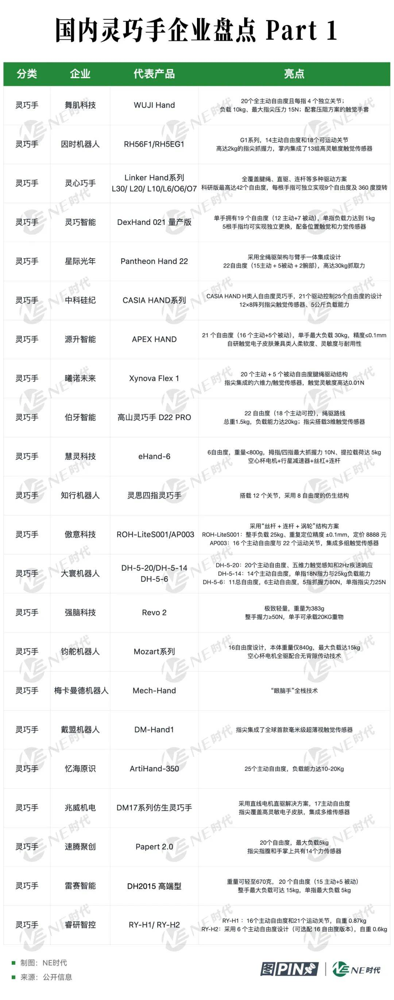

舞肌科技

舞肌科技推出的连杆驱动灵巧手产品 WUJI Hand，依托股东动力新科的电机研发优势，在尺寸和性能上表现突出。它与人手尺寸相当、手指修长且带有指甲设计，整体重量仅 600g，拥有 20 个全主动自由度，每根手指配备四个独立关节，除拇指外的四指还支持侧摆，能模拟人手完成复杂抓握与操作；采用全直驱方案，将电机内置手指，负载达 10kg、最大指尖压力 15N，数据反馈频率最高 1000Hz 且延迟低，售价仅 5 万元人民币。

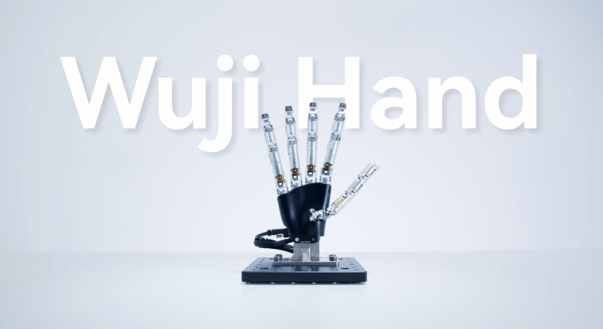

此外，舞肌同步推出压阻方案的触觉手套，展现出出色的灵活性。在官方的宣传片中，该手套可顺利完成转笔、按打火机、筷子夹球、使用剪刀、按遥控器等复杂掌内操作，充分满足精细动作需求。

因时机器人

因时机器人选择的是直线驱动+连杆/齿轮的技术路线，目前因时机器人已推出四大系列（F1、E2、DFX及BFX系列）、多种型号的灵巧手产品，可广泛适配市面上主流人形机器人，满足60%以上的手部抓取与操作需求，并在多个典型场景中实现稳定应用。在2025上半年，因时机器人灵巧手销量就已经超4000台。

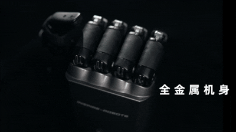

其中，RH56F1系列（以下简称F1系列）仿人五指灵巧手在结构设计、感知系统、稳定操控与安全防护等多个维度实现全面升级。全金属机身，骨架一体化设计，大幅提升结构刚性；通过集成触觉、力、位置和温度四大类共24组高性能传感器，实现多模态融合感知；同时支持高达1KHz高速实时通讯，30KG静态被动载荷，15N指尖抓握力，并通过20重标准严格测试，可靠性与安全性大大提升。

最新的RH5EG1系列（以下简称G1系列）高自由度仿人五指灵巧手具有14主动自由度和18个可运动关节，实现了高达2kg的指尖抓握力，完美兼顾了精细操作与强劲抓取能力。同时，掌内集成了13组高灵敏度触觉传感器，结合力觉和位置等多维传感技术，显著提升了抓取的稳定性与操作的精度。

灵心巧手

灵心巧手的核心产品 Linker Hand 系列灵巧手，科研版最高达 42 个自由度，每根手指可独立实现 9 个自由度及 360 度旋转，实际性能与寿命远超海外知名大厂产品；最新的腱绳灵巧手 L30 拥有 22 个自由度、20kg 最大负载和 ±0.2mm 重复定位精度，适配精密制造、医疗辅助等复杂场景。

目前，Linker Hand系列已全覆盖腱绳、直驱、连杆等多种驱动方案。L6 搭载自研超强电缸，能满足工业场景大负载、高速度需求，O6更是在50kg的惊人负载能力下达成了370g的目前全球量产最轻灵巧手成就。

Linker Hand 系列性能与寿命领先全行业，多款产品通过碰撞、坠落等严苛工况测试，最低售价仅 6666 元击碎灵巧手普及门槛。目前该系列月订单已突破千台，占据全球高自由度灵巧手市场 80% 以上份额。

灵巧智能

灵巧智能目前推出三款灵巧手产品，分别面向不同场景与用户。DexHand 021，首款量产绳驱五指手，已在高频数据采集与科研场景中验证可靠性；DexHand 021S，三指入门版，拥有8自由度，以双拇指构型实现约70%人手功能，降低使用门槛；DexHand 021 Pro，腕手一体专业版，拥有22自由度，具备端侧算力与全掌感知，实现“外力感知+内力控制”。

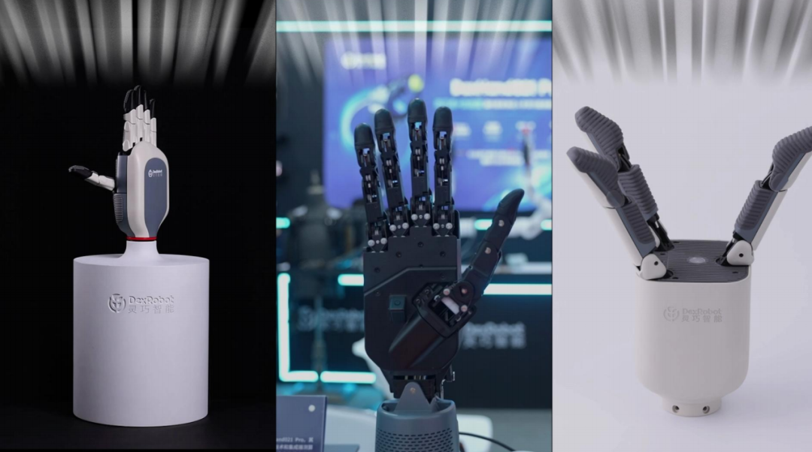

灵巧智能的 DexHand 021 量产版是商用高自由度多模态感知的智能通用灵巧手，单手拥有19 个自由度（12 主动+7 被动），单指负载力达到 1kg，5根手指均可实现独立更换，配备位置触觉和力觉传感器。DexHand 021 量产版拥有多样化的操作能力，比如掌内转动魔方、多物体抓取、柱状抓握、球形抓握、多指捏夹等超 15 种类人手功能操作。

星际光年

星际光年全新一代高性能灵巧手Pantheon Hand 22。该产品采用全绳驱架构与臂手一体集成设计，在驱动系统集成度、轻量化与操作灵敏性上实现突破。Pantheon Hand 22 具备22自由度（15主动 + 5被动 + 2腕部），单手可输出高达30kg抓取力，并内置自动张紧系统，显著提升长期运行稳定性与精度。同时，搭载自研三维力触觉感知，实现安全柔顺交互。

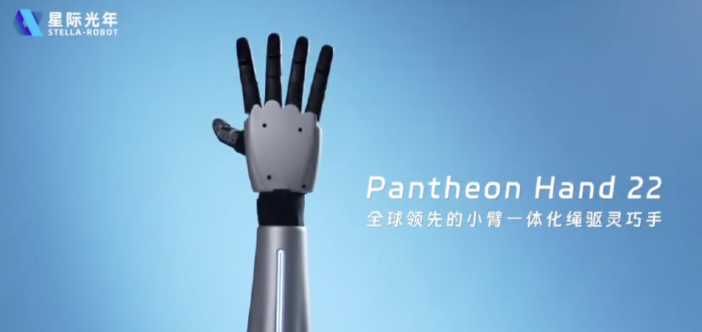

未来，Pantheon Hand 22 将与星际光年自研的灵巧手操作系统（小脑模型）协同，实现机器人在多场景下的自主学习与精细操作。

中科硅纪

中科硅纪的通用智能灵巧手CASIA HAND L系列提供两种配置选择，采用腱绳和刚性混合融合驱动方式。L1版本采用15关节7驱动设计，实现15公斤负载；L2版本采用12关节12驱动设计，负载提升至20公斤。

高速自适应灵巧手CASIA HAND S同样具备高达15 DoF，采用的三驱动、主-被动柔顺耦合设计，其最大720度/秒的超高手指关节速度确保了作业效率。此外，三指灵巧手CASIA HAND G则采用4个主动自由度配合被动自适应结构，5公斤负载能力，手指关节速度超过180度/秒，将成本控制在极具竞争力的水平，电商平台到手价5999元。

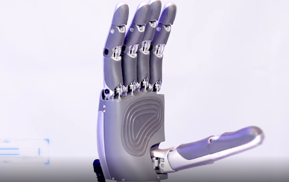

中科硅纪CASIA HAND H类人自由度灵巧手凭借21个驱动控制25个自由度的设计，实现了堪比人手的灵活度。12×8阵列指尖触觉传感器和5公斤负载能力的配置，使其能轻松完成穿针引线、调制咖啡等精细操作。

源升智能

源升智能的灵巧手Apex Hand 拥有 21 个自由度（16 个主动+5个被动），单手最大负载 30kg，精度≤0.1mm，响应速度与人手相当。坚持 21 个自由度的设计，源于对人手操作的深刻理解，拒绝盲目堆参数。凭借其在灵巧性、实用性和鲁棒性方面的全面突破，已收获数百家海内外客户订购意向。

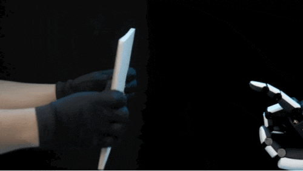

在技术与设计上，Apex Hand 不执着于单一传动路线，而是结合客户需求与各方案优点打造可规模化产品。此外，源升智能自研触觉电子皮肤兼具类人柔软度、灵敏度与耐用性，并能覆盖不规则的曲面。

Apex Hand还通过戳木板演示模拟真实场景冲击，解决业内灵巧手空载测试下寿命短的痛点；通过单手玩手机演示和把脉功能演示分别展现了灵巧度与触觉传感器灵敏度，后者还意外拓展了医疗应用方向。

曦诺未来

曦诺未来的 Xynova Flex 1 采用 20 个主动 + 5 个被动自由度腱绳驱动结构，腕部就具备2个自由度，高度模拟人手复杂骨骼与关节形态。手掌重量仅 380g 贴近人手，专为灵巧操作设计。

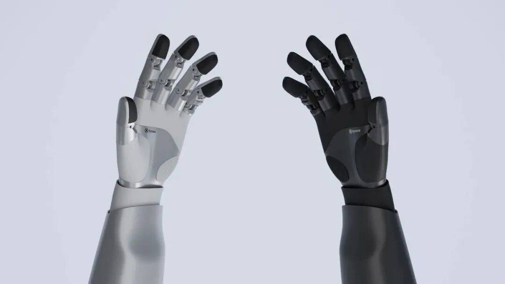

Xynova Flex 1通过全栈自研的核心动力与腱绳传动系统的融合，搭载完全自研的微型电缸，凭借高推力、快响应、小体积的优势突破核心部件 “卡脖子” 难题，实现高集成度腱绳驱动系统，将动力从前臂的微型电缸，通过高强度柔性腱绳精准传输至手部各关节。

指尖集成的六维力/触觉传感器，触觉灵敏度高达0.01N，能够精细感知物体的软硬、材质与滑动状态，从而实现对易碎物品的轻柔抓取、对滑动工具的稳固握持。同时，依托高分辨率编码器与先进控制算法，每个主动关节在全工作空间内的位置控制精度达0.5°，相较国际主流产品的1°精度，实现了50%的跃升。这意味着手指可以完成更为精细的动作，例如翻书、拨动开关、书写等对角度极其敏感的任务。

伯牙智能

伯牙智能高山D22 PRO 实现了 22个自由度，其中18个主动自由度，采用绳驱路线，通过腱绳传动与关节解耦控制，已可复现拇指对掌、四指内收的基础协同动作，关节轨迹复现精度达 0.5°（接近人手 0.3° 的控制精度）。伯牙智能高山 D22 PRO 支持电机+SMA两类驱动方式（2025年度只发布电机版本），可根据场景灵活切换，突破驱动源的单一性。2025年上半年，伯牙智能完成三个大版本的工程机验证，规划下半年启动小批量试制。

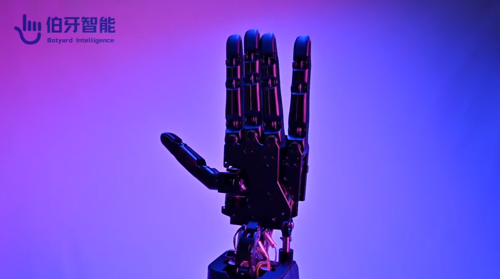

伯牙智能高山 D22 PRO 总重1.5kg，其中手臂1kg，手掌和手指500g接近人手的重量，走差异化路径，兼顾高自由度（22DOF）和力量（负载能力，拇指 60N、其他手指 40N 夹持力，自锁可稳定抓取 20kg）的均衡，减重中优先保性能 —— 用铝合金骨架和工程塑料外壳，自研力控腱绳驱动模组，驱动器外置 + 模块化设计使手掌最厚处≤4cm（接近人手）。该设计平衡性能与重量，既降低人形机器人臂部负载，又满足精密场景需求。拥有1 秒可完成三次握拳伸展（3Hz 循环频率）的响应速度，接近人类手部运动水平。

慧灵科技

慧灵科技发布的 eHand-6 工业灵巧手，6自由度，重量<800g，以 2999 元的颠覆性价格首次将工业级灵巧手带入千元时代，实现了成本与性能的平衡突破。

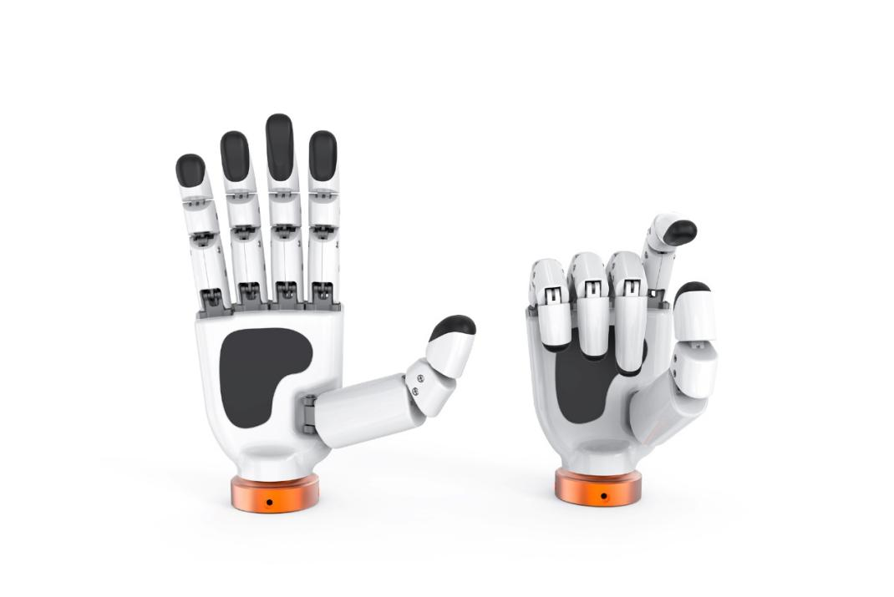

该产品依托全栈自研优势，高度集成空心杯电机、微型推杆及驱动器等标准化核心单元，通过紧凑结构设计模拟人类手部发力模式，搭配高性能控制器实现精准力控。采用“空心杯电机+行星减速器+丝杠+连杆”的传动方式，其 5 个手指均为三指节构造，各指节具备合理弯曲角度，配合多自由度协同控制可复现人类抓取、握持等动作，拇指/四指最大抓握力 10N、提拉载荷达 5kg，可选配 5 通道触觉反馈传感器，构建全方位感知系统，实现 3N-10N 的动态力控。

知行机器人

知行机器人已推出多款创新产品。其中包括九章三指灵巧手，这款产品采用模块化设计，以9个主动自由度，实现95%的五指功能，搭配1.4N·m扭矩电机，抓取有力。此外，知行机器人的灵思四指灵巧手，搭载 12 个关节，采用 8 自由度的仿生结构，能精准复现人类手指灵活轨迹，完成抓取、捏合等复杂动作，凭借先进感知技术，保障稳定作业。

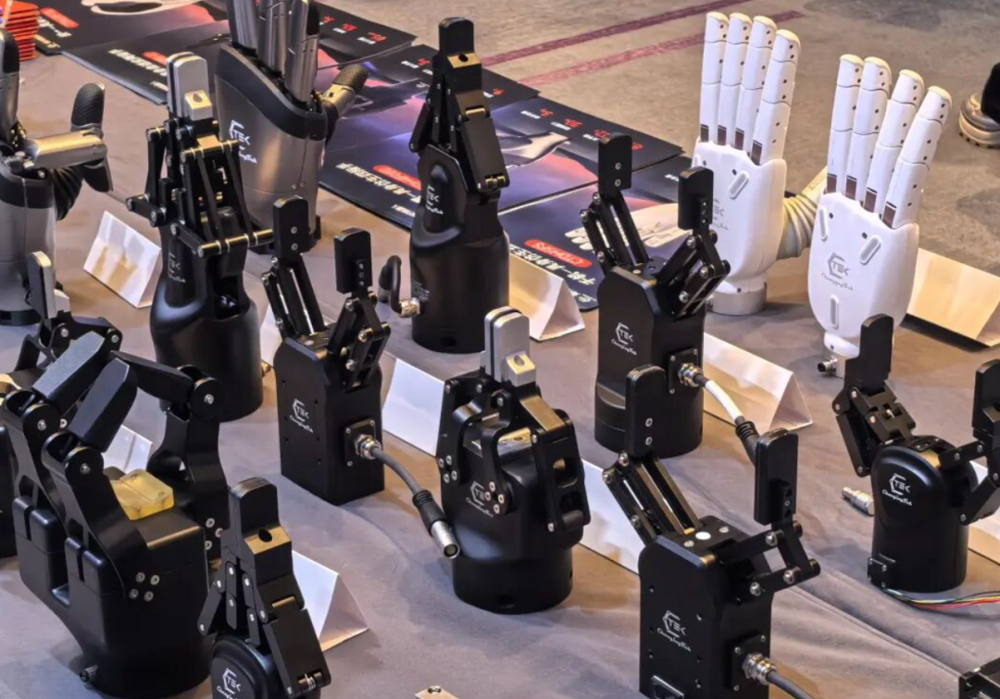

傲意科技

傲意科技采用的是“丝杆 + 连杆 + 涡轮”结构方案，目前已推向市场的有 ROH-AP001、ROH-AP002，还有小尺寸工业灵巧手 ROH-LiteS001，整手负载 25kg、重复定位精度 ±0.1mm，定价 8888 元。AP001 也已处于待上市阶段；按计划，预计年底将推出 AP002，研发团队还在持续深耕，同步推进更贴近真人手的 AP003 研发。

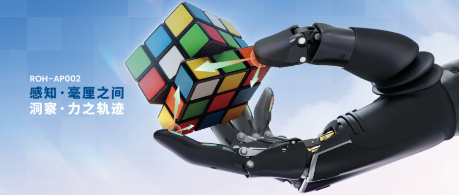

AP003 的核心指标很明确，搭载16 个微型马达，实现 16 个主动自由度与 22 个运动关节，同时集成多组触觉传感器，打造成准工业化产品，重点保障更长的使用寿命。

大寰机器人

今年9月，大寰机器人集中发布了三款工业智能灵巧手新品DH-5-20五指灵巧手、DH-5-14五指灵巧手、DH-3-7三指灵巧手。加上此前推出的DH-5-6触觉灵巧手（11个总自由度，6个主动自由度，5指抓握力80N，单指指尖力25N），大寰机器人完成了从三指到五指，从6自由度到20自由度的灵巧手产品布局。

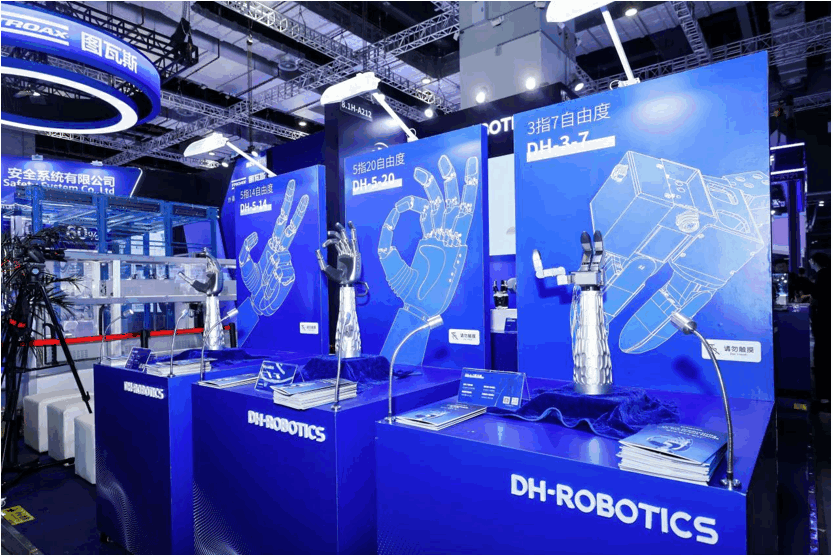

DH-5-20五指灵巧手以20个主动自由度、五维力触觉感知和2Hz疾速响应，面向非结构化任务，实现了接近人手的精细操作与智能响应；DH-5-14五指灵巧手则在14个主动自由度仿人构型基础上，强化了单指18N指力与25kg负载能力，在保持高灵巧性的同时，更侧重高负载下的稳定与可靠；而DH-3-7三指灵巧手则以精简的7个主动自由度仿生设计、即插即用特性和高性价比，为广泛的工业抓取应用提供了稳定、高效且易于部署的灵巧手解决方案。

强脑科技

强脑科技通过自研电机、传感器和脑机接口算法，将仿生手产品的技术思路延伸至灵巧手，通过使用特殊复合材料并辅以模块化设计，保证结构强度的同时，大幅降低了自重。

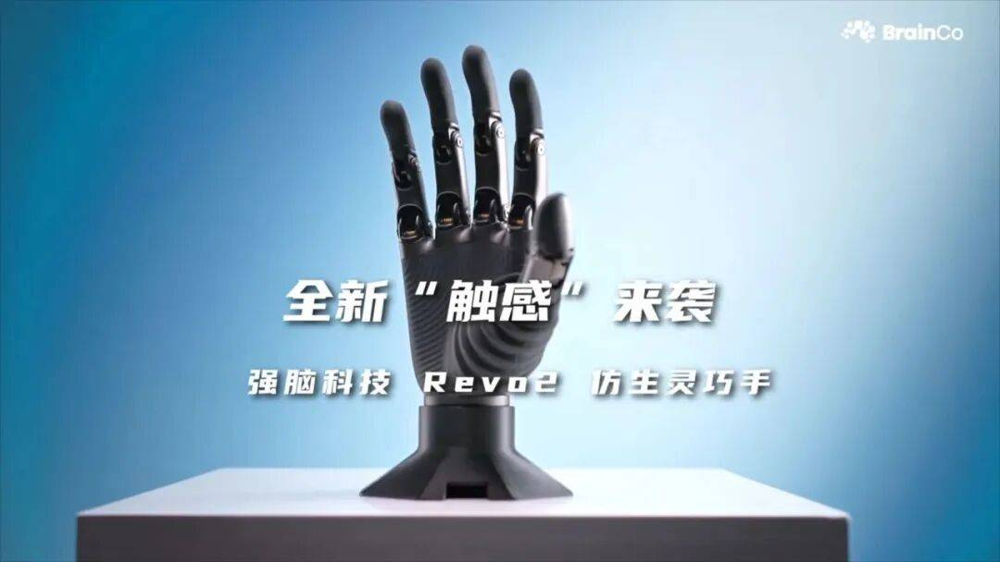

强脑科技的仿生灵巧手Revo 2，这款产品参考人体工学，是一款超轻量、超小巧的仿生灵巧手，重量为383g，尺寸在16\*7.6cm，可完成0.1mm的亚毫米级操作精度，整手握力≥50N，单手可承载20KG重物，能够稳定支撑壶铃等大负载物体。其搭载多模态触觉传感器，支持64V宽电压，支持等多种通讯协议。Revo 2 通过内置集成三维触觉传感器，在保持克重的同时，赋予灵巧手感知物体硬度、纹理、受力方向及接近距离的能力。

钧舵机器人

钧舵机器人的Mozart系列灵巧手，本体重量仅840g，尺寸201.2×150×4.5mm，16自由度设计，拇指独拥侧摆与大范围活动能力（旋转≤90°、弯曲≤80°），精准复刻人手复杂动作；空心杯电机全驱配合无背隙传动技术，重复定位精度达±0.02°，多轴联动稳定流畅；每指集成三维力传感器，实时捕捉50-2000g压力，精度±5%，触觉感知延伸至力反馈、滑动与纹理识别；四指握力25N，拇指峰值35N，整手最大负载达15kg。

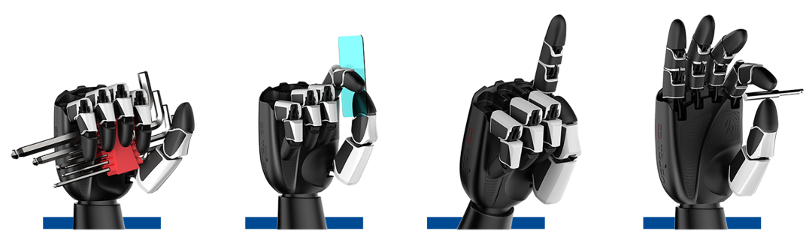

梅卡曼德机器人

梅卡曼德的Mech-Hand五指灵巧手具备多个关节及自由度，能够像人手一样灵活、精细操作物体，并更好适应狭窄复杂的真实货架空间。凭借灵活紧凑的硬件设计和先进的算法，能够灵活操作各类物体。

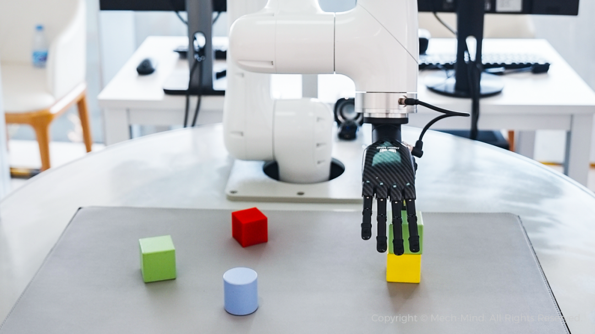

Mech-Hand大小和身高1.7m左右人类手掌大小相当，相比市面上常见的多指手体积更小，更利于操作常见物体。通过梅卡曼德的泛化AI抓取技术，Mech-Hand可以抓取和操作种类繁多的物品，展现出强大的泛化能力。

戴盟机器人

戴盟的多维触觉感知灵巧手DM-Hand1，采用仿生结构设计，12个自由度，6主动关节精准协同，重量650g，拇指最大抓握力14N，四指最大抓握力11N。依赖单色光视触觉的原理，于灵巧手指尖集成了全球首款毫米级超薄视触觉传感器，配合力位混合控制算法，赋能机器人完成自适应抓握力控制、易碎易损件柔顺操控、精密零部件装配等高难度任务。

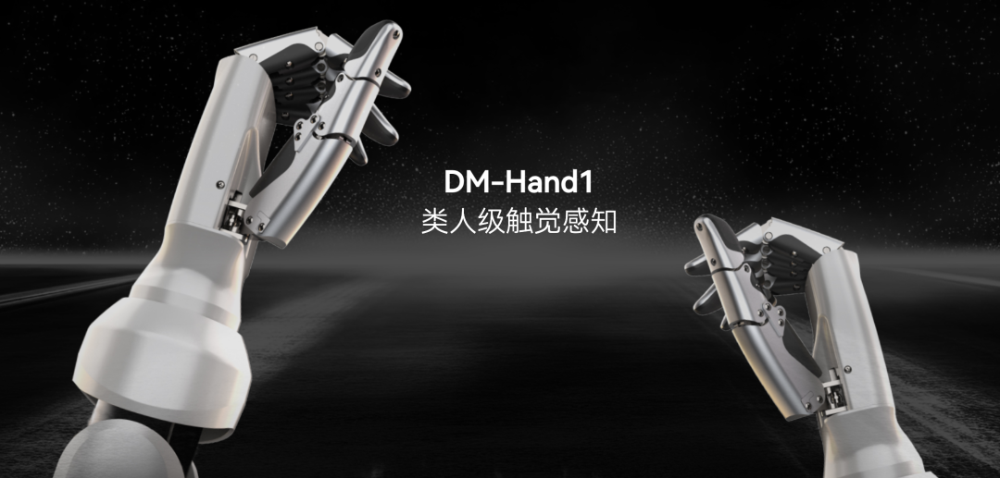

忆海原识

忆海原识工业级灵巧手 ArtiHand-350 ，采用仿生结构设计，具有25个主动自由度，负载能力达10-20Kg，可实现灵活且精细的操作，动作精度可达0.1°。该产品研发基于深厚的人体解剖学和神经系统研究，小臂和手部通过两个自由度的腕部相衔接，将大部分电机置于小臂内，采用腱传动技术实现手指关节的灵活驱动，该设计降低对电机的要求，从而实现成本的平衡。同时注重小指和无名指设计，其腕掌关节能实现复杂曲面操作，解锁全部尚依赖人手的作业。

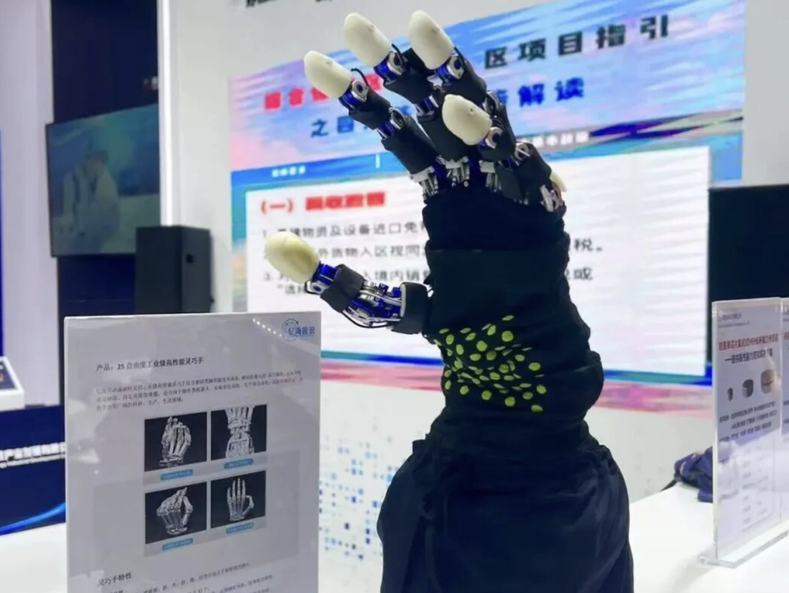

腱传动系统借鉴人体肌腱结构，实现了高灵活性、高负载与高寿命的平衡；触觉传感器突破传统测力思路，模拟人类皮肤的多层神经末梢感知机制，感测与物体的综合接触情况。

兆威机电

作为国内领先的微型驱动系统供应商，兆威机电自主研发的ZWHAND 系列灵巧手已成为人形机器人、工业自动化等领域的核心执行部件。兆威机电独创 “关节内置动力单元” 设计，将电机、减速器、传感器高度集成于手指关节，体积较传统方案缩小 30%，适配人形机器人轻量化需求。

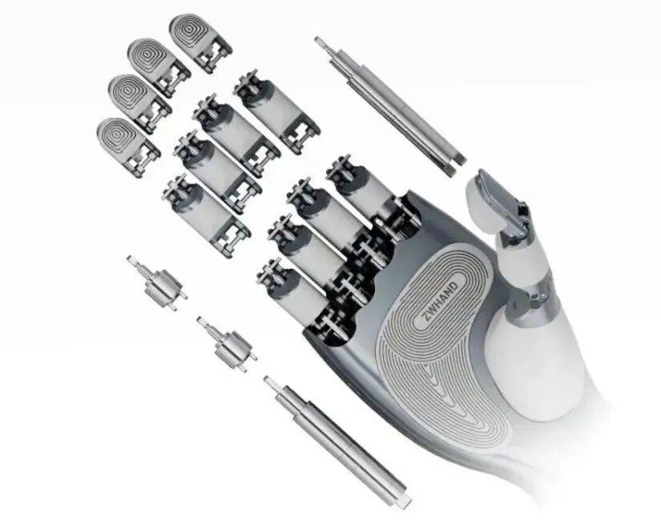

今年7月，兆威机电首次公开发布DM系列17-20自由度全驱动灵巧手，同时发布LM系列6自由度欠驱动灵巧手。驱动方面，DM系列17自由度直驱系列手指根部采用自研空心杯电机(功率密度＞0.5W/g，转动惯量极低)，指关节处采用步进电机；LM系列6自由度欠驱系列采用无刷直流电机，具备自锁能力。传动方面，DM系列17自由度直驱系列手指根部采用一级行星齿轮箱减速，使用滚珠丝杠+推杆将旋转运动转为直线运动。指关节处为特殊设计步进电机，电机转轴替换为滚珠丝杠直接与推杆连接，高度集成体积小适配指关节，LM系列采用连杆传动。

速腾聚创

速腾聚创第二代灵巧手Papert 2.0采用仿人手设计，具有20个自由度，最大负载5kg，在指尖指腹和手掌上共有14个力传感器。配合机械臂及其控制系统，Papert 2.0可灵活复刻人手的精细动作和操作。它可以用四自由度的食指操作电动螺丝刀，也能力度精准适中地拿起鸡蛋。

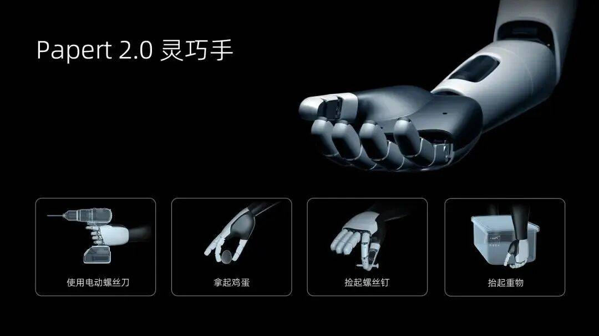

Papert 2.0可结合各类传感器的感知信息与手部动作进行闭环控制,通过“手眼协同”提升面对不同任务的通用性和和操作准确度，并开发出丰富的场景应用。

雷赛智能

雷赛智能的今年6月发布的 DH2015 高端型，采用轻量化结构设计及最新材料技术，重量可轻至670克。其拥有 20 个自由度（15 主动+5 被动），采用无刷空心杯伺服电机、FOC 电流环与力位混合控制算法，耐碰撞结构设计，抓握寿命超过 100万次，标配触觉传感器（508 点阵），整手最大负载可达 15kg，单指最大负载 5kg，胜任多样化抓取任务。

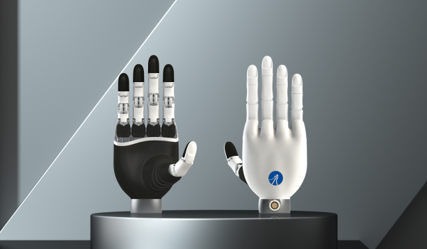

今年7月，雷赛还推出三个版本的灵巧手DH116S增强版（多模态触觉）、DH116标准版（压阻式触觉）、DH116C经济版（不带触觉但是采用混合力位算法提供压力反馈）。重量轻至490g，11个自由度，508触点，压力控制精度0.1N。

睿研智控

睿研智控的RY-H1 灵巧手具备 16 个主动自由度和 21 个运动关节，自重 0.87kg，单指最大指尖力 20N，最大抓握力 160N，支持EtherCAT\\CAN\\CANFD等多种工业通讯协议，适配精密装配场景。面向轻量型操作需求的 RY-H2 标准版，则采用 6 个主动自由度设计（可选配 16 自由度版本），自重仅 0.6kg，拇指侧摆与弯曲速度达 360°/s，最大抓握力 140N，推荐负载 10kg，在保持紧凑结构的同时实现高效作业。两款产品均支持触觉传感器选配，为不同精度要求的工业场景提供灵活解决方案。

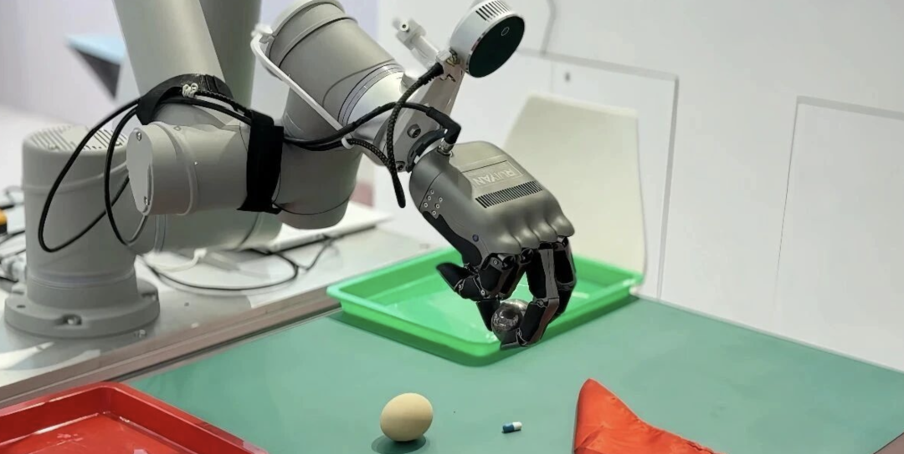

未完待续
