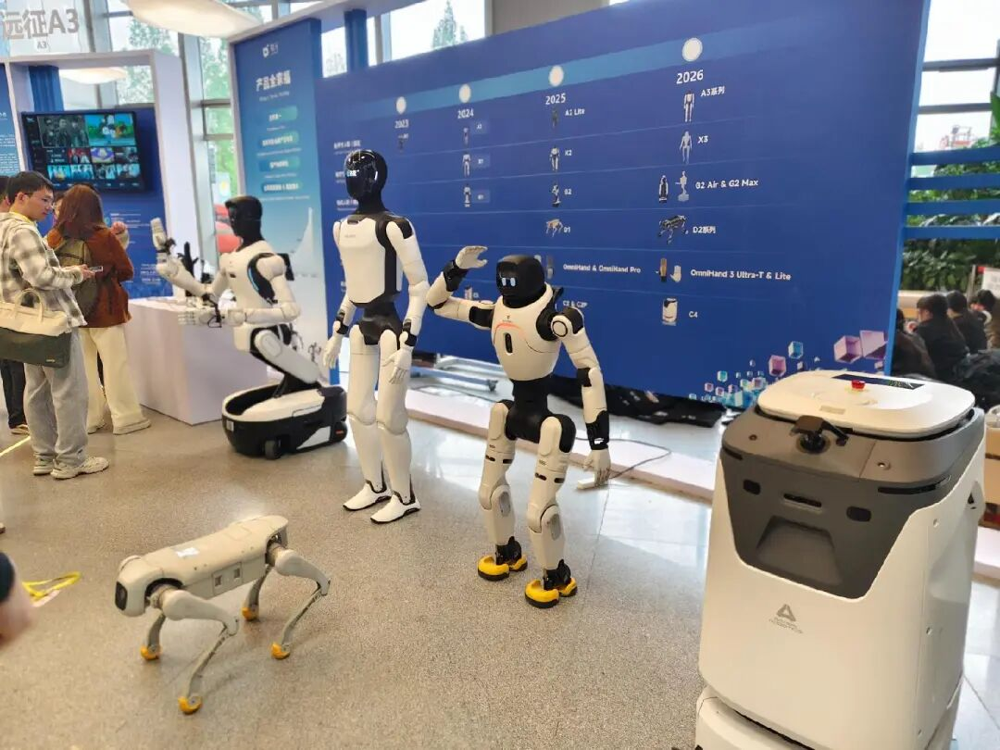

# “野心家”智元和它的具身宇宙-36氪

> Source: https://36kr.com/p/3808752499826433?utm_source=chatgpt.com
> Collected: 2026-05-18
> Published: 2026-05-18
> Author: 任晓宁 / 经济观察报；36氪经授权发布
> Original clipping: ../../Clippings/“野心家”智元和它的具身宇宙-36氪.md

有业内人用“野”来形容智元，因为它一直表现得很有野心。它的打法很像字节或阿里等巨头，而不像一个成立仅3年的创业公司。

编者按：具身智能这四个字，在2026年上半年以前所未有的速度吸纳着资本、人才。单轮融资5亿元已是寻常，20亿元、30亿元的巨额支票也在接连落下，一家家成立两三年的初创公司，在数轮融资后估值跨越百亿门槛，身后站着红杉、高瓴、腾讯等顶级投资机构；技术天才与产业老将联袂登场，华为、阿里背景的创业者成为标配。

当估值与营收的剪刀差日益扩大，我们将目光锁定于那些踏入或正叩响“百亿俱乐部”大门的具身智能公司，希望探析：在令人眩目的估值背后，具身智能公司核心技术的护城河有多深？量产与交付的难关如何跨越？天价机器人何时找到真实的需求场景？

从全栈自研的本体厂商，到专注大脑的模型公司，再到专攻机器人灵巧双手、精密触觉、仿真数据的细分龙头，我们将逐一走进这些百亿估值的明星企业，解析其技术路径、商业逻辑与生存哲学。

5月12日，智元机器人（下称“智元”）在香港举办合作伙伴大会，推广机器人产品。自4月以来，这家公司频繁发声，此前引发关注的是一场人形机器人进工厂打工的8小时直播，20万人次观看，除了想监督机器人干活的网民，一些投资人、竞争者也在看。

这是国内第一场人形机器人在3C工厂真实产线上下料的直播，智元试图告诉外界，机器人真的能打工了。不是演示版，不是特定场景，不是摆拍，而是真实的工作。

大众印象中，智元机器人不如宇树科技知名，但宇树科技在上市招股书中把智元视为重要竞争对手。

2026年4月，国内有近20个估值百亿元以上的具身智能公司，智元在去年3月已经估值150亿元。

在一众具身智能公司中，智元特色鲜明。其他公司有的做本体，有的做大脑，有的做小脑，有的做灵巧手，有的做数据，智元则全都做。

同时，智元还分拆了6个子公司，投资入股60多家公司，联手了180多个合作伙伴。这种打法很像字节或阿里等巨头，而不像一个成立仅3年的创业公司。

有业内人用“野”来形容智元，因为它一直表现得很有野心。成立第一年，智元就在上海张江自建机器人量产工厂和数据采集工厂。成立第二年发布产品，就推出了5款机器人。

2026年，智元开始在各个领域争第一：第一个量产10000台机器人的公司，第一个直播机器人在工厂8小时真实打工的公司……

4月17日，在智元的合作伙伴大会上，创始人邓泰华2小时的演讲用了31个最字和18个第一（首个、首家）。“我们已经断崖式领先。”智元联合创始人、总裁兼CTO彭志辉（稚晖君）这样对经济观察报说。

智元似乎要用3年走完同行10年的路。由于业务大，它的员工人数也比同行多，其他百亿级具身智能公司的员工数一般为两三百人，即使是成立近10年的宇树科技，员工数也不过480人（宇树招股书披露，截至2025年9月末）。而智元仅母公司的员工就有1570多人，今年年底将增加到2000多人。

多数具身智能创业公司高管团队人数并不多，一般由创始人、CTO或首席科学家组成。在宇树的招股书中，核心高管有4个人。智元则有2个创始人和5个合伙人，每个人都有总裁或副总裁的职级。有不熟悉智元的人在社交媒体评价“公司一共多少人？这么多总裁”。

在许多具身智能公司官宣10亿元、20亿元新融资的2026年，智元没有公布融资消息，接近智元的人士告诉经济观察报，2025年年底，智元获得了一轮融资，只是没有对外宣布。有智元人士称，很多投资人想投智元，被他们拒绝了。

## 量产的代价

4月17日，智元发布了4款机器人新品，加上此前发布的远征A1、A2，灵犀X1、X2，精灵G1、G2，以及子公司上纬启元的Q1，智元已经有11款人形机器人产品。

对比同行，宇树科技3年内发布了4款人形机器人，众擎机器人有4款，银河通用有3款，星海图有3款，自变量有2款。

智元的具身同行中，宇树科技、松延动力等侧重本体，更在乎机器人运动能力，银河通用、星海图、自变量等侧重大脑，强调机器人的智力。智元则是一家什么都做的全栈型公司。记者了解到，智元目前1570多名员工中，有70%以上从事具身大模型研发，研发人员比很多具身公司全员都多。

3月30日，智元宣布10000台机器人量产下线。在绝大多数同行的出货量还在几百台至几千台的阶段，量产10000台是较为罕见的事。在手机、汽车等成熟产品领域，量产制造是流水线、开模、注塑、组装等一系列标准化的流程，但人形机器人的量产并不容易。

智元合伙人、高级副总裁、通用业务部总裁王闯负责量产业务。他说，第一批量产机器人可以用“苦难”来形容。主要原因是，人形机器人供应链不成熟、配合度不高、零部件不齐全。

智元工厂第一批量产的机器人，刚装出来就发现有严重问题，需要批量返工。2024年8月，智元的机器人从1台做到了200台，当时一台机器人最多需要返工10次。

这次尝试让智元把工厂产线搭建、机器生产测试流程、供应链体系跑了一遍，之后量产速度变快，从1000台到5000台用了近一年时间，从5000台到10000台用了3个月时间。

投资过多个具身智能独角兽公司的清智资本创始合伙人张煜测算，全流程量产机器人工厂需要上百亿元投入。

与同行相比，智元在资本市场获得融资轮次较多。根据公开消息，智元成立3年融资12轮，银河通用成立3年融资5轮，宇树科技成立9年融资9轮。

2025年8月后，智元没有公布过融资消息。彭志辉告诉经济观察报，智元目前已经能自我造血，并不缺钱，对外部一级市场的融资没有迫切需求，而且，如果拿太多钱，公司股份会被稀释。

智元没有对外公布投入机器人的费用，但很可能是具身智能公司中花钱最多的一家。连续4次投资智元的蓝驰创投合伙人曹巍粗略估算，智元的研发投入，是同行竞品平均投入的5倍到—10倍。

智元合伙人、高级副总裁、具身业务部总裁姚卯青提到，智元的团队到2026年底可能会到2000多人，仅员工工资，每年至少是十几亿元至二十亿元的支出，再加上机器人本体、设备、数据采集、模型训练、算力等，智元对具身智能做了非常大的投入。

舍得花钱也是业内对智元较深的印象之一。

一家北京海淀具身独角兽公司人士提到，2026年之前，具身行业人士对智元的评价比较分化，一派认为智元是花钱买声量，在攒资本局。另一派则认为，智元比较实在地一步步做业务，通过扩大朋友圈赢得生存权。2026年之后，随着智元一系列战绩亮相，更多人的态度开始偏向后者。

## 具身宇宙

虽然是一个成立刚3年的创业公司，但智元已有6个分公司，分别是：智鼎机器人、上纬新材、擎天租、觅蜂、临界点、智元酷拓。

上纬新材是智元2025年收购的上市公司，彭志辉担任董事长。擎天租是做机器人租赁的平台，姜青松担任一把手，他也是智元合伙人、营销服总裁。觅蜂是做具身智能数据采集的公司，姚卯青为负责人。临界点是做灵巧手的公司，邓泰华担任董事长，他也是智元创始人、CEO，是智元公司的操盘手。智元酷拓是做机器狗的公司，邱恒负责，他同时担任智元的CMO。

早在2025年4月，智元就成立了第一家子公司智鼎机器人。其余几家子公司都在最近半年内成立，最晚分拆的是智元酷拓，今年4月独立拆分。

彭志辉评价智元子公司属于“富二代创业”，有的子公司成立才三个月估值就超过5亿元，发展速度比智元当年快得多。今年2月，觅蜂、临界点、擎天租都分别获得数亿元融资，其中临界点今年1月注册，2月份时已完成3次融资。擎天租成立4个月完成4轮融资，CEO李一言称，将以“大概每月一轮”的计划推进融资，直至2026年中暂停。

擎天租去年12月成立，目前已经有120名员工，有400多个城市经销商。一位擎天租城市经理告诉记者，北美、欧洲等海外市场也能通过擎天租租赁机器人。该公司目前估值30亿元。

记者了解到，智元的子公司早期不会做重资产运营，员工数字会维持在100多人。每个公司有独立的CEO、COO、CSO、CMO等，智元高层虽然担任一把手，但较少露面，主要决策由子公司高层负责。不过，智元是每个子公司的大股东，持股基本都在58%以上，对子公司有较强的管控。

此外，智元还建立了庞大的朋友圈。据记者不完全统计，智元目前有180多家生态伙伴，包括投融资、供应链、技术、市场渠道、解决方案、JV（合资企业）等多个维度。

4月中旬，智元机器人打工8小时的直播发生在江西南昌的龙旗工厂，龙旗工厂隶属于龙旗科技。龙旗科技在2025年3月参与了智元机器人的B轮融资，并出资3000万元参与了由高瓴资本与智元机器人联手设立的早期投资基金——上海瓴智新创创业投资合伙企业。去年10月，龙旗科技下达了数亿元金额的智元精灵G2机器人框架订单，计划部署近千台机器人。

目前，智元共有4台机器人在龙旗工厂工作。为了这次打工，智元与龙旗工厂成立了几十人团队的攻坚组，前后耗时近半年时间。这4台机器人主要做平板电脑出厂前的检测工作，如果想让它们检测手机，还需要再进行调试。

龙旗科技2111实验室具身机器人应用项目负责人张龙说，制造现场和具身系统的融合，现在仍有非常大的挑战。机器人正式进工厂前，攻坚组需要先在实验室里搭建仿真模拟环境，再在副产线做测试，适应现场真实光照的环境，达到一定连续压测通过标准之后，才能进入真实产线。

天眼查显示，智元投资的公司（存续或在业）已达65家。有一种评价认为，智元已经不是单纯造机器人，而是在打造一个具身智能“宇宙”。

曹巍认为，通过产业端的渗透，智元可以拿到更多的资源，因为产业合作伙伴属于“你中有，我中有你”，大家希望互赢互利。

一位接近智元高层的人士告诉记者，智元要做的是具身智能行业的链主企业。彭志辉此前接受采访时也提到，智元在用一种运营大公司、操大盘的方式创业。

## 大厂基因

这种创业思路，与智元高管团队的出身有关。

智元的高管团队，主要来自华为、大疆、理想等企业。智元高管中知名度最高的彭志辉，创业前曾在OPPO和华为工作过。智元创始人邓泰华曾担任华为计算产品线总裁。

蓝驰创投于2023年8月投资智元，第一轮投了1.5亿元，之后连续多轮下注，共拿出3亿元以上资金。投资之前，曹巍通过多个渠道了解调研，判断邓泰华是一个能操盘复杂平台型业务的人。

“他有20多年的工作经历，从技术、产品，到售前、海外区域主管、合作伙伴生态运营、事业部BU一号位，他都做过。”曹巍认为，有这样经历的人出来创业，和从学校出来的老师、学生创业是不一样的，“每个人都是自己经历的产物。经历过就会轻车熟路，没经历过就得交学费，对吧？”

创办智元是邓泰华第一次创业。他创业的态度很坚决，自己投了钱，并在创业之初就对智元做了3至5年规划，包括产品、技术、商业路径、团队、人才储备等。现在回看3年计划，曹巍认为，智元基本上都超额完成目标了。

智元的另一个重要人物是彭志辉。创业之前，彭志辉是B站网红，有200多万粉丝，入选过B站百大UP主，他也是智元成立之初就获得较高关注度的原因。接受记者采访时的彭志辉，穿着运动鞋，说话是正常人的1.5倍速。在曹巍看来，彭志辉和邓泰华联手创业，两个人能力互补，给团队带来了方向感和凝聚力。

智元其他高管，都来自大厂。姚卯青曾经是Waymo（谷歌旗下自动驾驶公司）核心成员，在蔚来汽车担任自动驾驶技术总监；姜青松曾任华为海外企业国家主管，也担任过阿里云海外CTO；智元合伙人、高级副总裁、通用业务部总裁王闯，是大疆激光雷达产品线创始团队成员，他也是智元机器人量产工厂的核心负责人。

无论是投资人还是智元高管，都在采访中多次提到智元团队“非常有战斗力”。彭志辉一天只吃一顿饭，睡五六个小时，自我评价“智元是卷王之王”。

上述接近智元高层的人士说，晚上12点前给智元合伙人发消息，几乎都是秒回，该人士近一年很少有休息日，几乎全年都在上班。

张煜很遗憾自己团队由于时间等因素，没有投到智元，因为智元这样的公司属于他“必投”的类型。他在2023年投资过多个具身智能独角兽公司，包括智平方、松延动力、极佳视界等。

“必投”的原因之一是智元团队。这支团队核心成员来自制造业大厂，执行力强、工程化能力强，是其他创业公司较少具备的。而且智元成立之初就决定走产业路线，注重商业落地，也是张煜认可的地方。

智元公司位于上海浦东新区秀浦路，这是一个机器人公司聚集地。最初，智元在一栋楼里办公，现在已经有3栋楼挂上了智元的标识。

这家公司组织结构扁平，层级较少，一线研发往上两级，就是彭志辉。目前智元全公司只有彭志辉一个人有独立办公室，因为他负责创新业务，需要保密。其他所有高管，包括邓泰华在内，都在开放式办公区办公。

## 更多野心

智元的对外介绍用词喜欢用“首个”“第一”“最”。智元的高管们也很喜欢提到这些词。

彭志辉说，智元目前已经在具身行业“断崖式领先”，是全球唯一全栈且突破万台量产规模的公司——特斯拉都还没做到。姚卯青也说，智元是全球的领头羊，必须很多第一个事情都由智元做出来。

智元的成长一直伴随着质疑。3年前刚成立时，外界对网红创业的智元信心并不大。成立之初，有投资人对其估值产生质疑，认为数字夸大了。首款人形机器人发布时，业内人士评价其产品相比同行还有很大改进空间。宣布商业化进展后，一些评论认为智元摊子铺得太大，更擅长资本操作。2026年，智元密集显示战绩后，外界对智元的质疑声少了一些。此时，智元又画出了更大的饼。

收入方面，2025年智元卖出了5000多台机器人，收入10亿元。2026年，智元的销售目标是2—3万台，这意味着将有40亿元至60亿元的收入。邓泰华说，智元会在2027年跨过100亿元的营收。

目前智元有25%的收入来自分销商和渠道商，并计划在2026年将这部分的比例提升至60%。邓泰华提出，2030年，智元将构建采购额50亿级伙伴5家、10亿级伙伴20家、1亿级伙伴40家的千亿共同体。

海外部分，邓泰华说，今年智元收入的30%会来自于海外，不久后将有50%以上海外收入占比。今年智元将在美国、欧洲等海外区域建制造工厂。

这意味着，智元还要花更多的钱。

具身智能的战斗还还未真正开始。目前，荣耀、小米等手机厂商，小鹏、理想等新能源车厂都已经布局机器人业务。这些手握巨额资金，有成熟工厂和产业链的巨头，很有可能对具身行业带来降维打击。

一位接近智元的人士说，这是智元着急在3年内快速扩大规模，并计划联手更多合作伙伴的原因之一——只有自己够强壮，朋友够多，才能在战争中活到最后。

彭志辉判断，大厂目前的主战场还不在具身领域。“很多车厂的智驾道路还没有跑完，他们不会投足够多资源到新兴赛道。”

张煜认为，大厂会是具身智能创业公司最大的威胁。尤其是硬件领域，当某个新兴赛道从科研落地到产业时，大厂就开始下场了。届时，创业公司很容易在资金和资源层面遇到大厂的挤压。如果不IPO的话，后续资金可能很难与大厂抗衡。智元需要在上市后，让自己的市值快速从几百亿元上涨10倍至几千亿元。到达这个体量后，才算真正安全。否则，大厂很容易通过价格战等方式，把创业公司挤出市场。

本文来自微信公众号 [“经济观察报”](https://mp.weixin.qq.com/s/2dDW4HmzMUIcVg4HCy0-uw) ，作者：任晓宁，36氪经授权发布。
